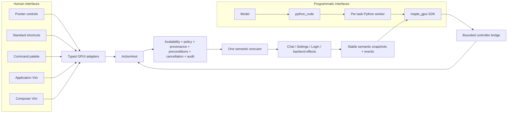

> **Archived 2026-09-09:** original description of benthecarman/maple-gpui PR #2 ("Developer preview: make Maple a programmable semantic application"), kept for reference alongside `programmable-harness.md`. Links and file paths refer to the retired `maple-gpui` repository.


> **Draft / Developer Preview — preserved integration prototype**
>
> This is an architecture-complete proof of concept for discussion and hands-on
> evaluation. It is intentionally broader than a normal feature PR because the
> value is in proving one end-to-end application contract. It is not a claim
> that native Python is production-contained, that every Vim edge case is
> complete, or that this should merge unchanged. The branch is intentionally
> maintained as one squashed commit targeting `master`; focused production
> changes will be extracted and reviewed separately.

## What I am asking for

I would especially value feedback on the architectural direction and the seams
between the crates—not a line-by-line endorsement of roughly 90 files at once.

The central question is:

> Should Maple have one typed semantic application contract, with pointer UI,
> shortcuts, Vim, Python, and model-driven workflows acting as clients of that
> contract?

This PR is now the stable full-system reference and dogfood target, not a
request for line-by-line approval of the entire diff. Focused follow-up PRs will
start from `master` and must stand on their own even if the rest of this preview
never ships. If the direction does not feel right, this remains early enough to
change course without committing the product to the experiment.

## Context: why build this now?

`maple-gpui` has already demonstrated that Maple's desktop and agent runtime can
exist outside the Tauri shell. That creates an unusually good point to decide
what the native application's control boundary should be before more UI and
automation features accumulate around screen-local callbacks.

Several useful features were converging at the same time:

- editable shortcuts and a command palette;
- whole-application Vim navigation;
- a real modal Vim engine for the composer;
- persistent Python for model computation;
- model-driven control of Maple itself;
- future macros, generated UI, and recursive-language-model workflows.

Building each directly against GPUI callbacks would produce parallel command
systems. Buttons, keybindings, Vim, and model tools would drift on naming,
availability, authorization, completion, cancellation, and audit behavior.
Coordinate clicking or synthetic keystrokes would add another brittle layer,
especially over virtualized transcript/sidebar content.

This branch pays the migration cost once: existing semantic controls move onto
one typed action spine, and every new interface uses it.

## The architectural thesis



The registry is not metadata beside legacy behavior. A pointer click and a
model request for the same operation converge on the same descriptor, policy
check, executor, result, and event. That is the most important invariant in the
branch.

### Dependency boundaries

| Layer | Owns | Deliberately does not own |
| --- | --- | --- |
| `maple-harness` | Wire-safe actions, descriptors, stable targets, policy, provenance types, audit, revisions/events, keymap data | GPUI, effects, account clients, Python |
| `app/src/harness` | Catalog/adapters, `ActionHost`, the one executor, keymap runtime, palette, which-key, application Vim, controller bridge | Python execution or credentials |
| Screen/business modules | Live availability and the operation that owns each mutation/effect | A second authorization or action system |
| `maple-code-mode` | Interpreter discovery, framed protocol, persistent account/task kernels, limits, cancellation, process-group lifecycle, controller transport trait | GPUI, account clients, credentials, Maple action implementations |
| `maple-agent` | Model-facing `python_code`, model-run identity/cancellation, conditional built-in controller skill | GPUI or application action execution |
| Python `maple_gpui` SDK | Discovery, invoke/wait, queries, pagination, events, thin task/workspace helpers | Authority tokens, credentials, GPUI/Rust objects, arbitrary method access |

The dependency direction is intentional: the portable crates describe and
supervise; the app is the only layer that can finally authorize and execute a
Maple UI operation.

## Important invariants

### One action, one implementation

The checked-in catalog currently contains 166 stable actions. The strict source
audit inventories 219 production activation callbacks: 188 route through the
semantic harness and 31 are explicitly classified local mechanics such as
hover, hit testing, scroll, or selection painting. There are no unexplained
legacy-direct gaps.

### Availability is not authority

Screens answer whether an operation currently makes business/UI sense. The root
host separately authorizes who may perform it. A visible enabled control never
becomes proof that a controller may call the same action.

### Provenance is host-assigned

Programmatic callers cannot claim `DirectUser`, choose their account/task,
select a policy epoch, or mint a capability. Direct-human provenance is a
bounded, single-use root input capability. Generic actions such as “activate
selected” resolve their concrete backing action and reauthorize it; aliases are
not policy shortcuts.

### Stable identity survives GPUI refactors and virtualization

The external contract uses stable action IDs and semantic targets—not vector
indices, focus handles, render element IDs, Rust type names, or callbacks.
Targets carry revision/precondition data so stale state fails closed. Semantic
selection, GPUI focus, text insertion, viewport position, and streaming-follow
state remain separate concepts.

### Accepted is not completed

Async operations have correlated invocation/operation identities and semantic
completion events. The SDK's `invoke_and_wait` captures the event cursor before
dispatch so a fast completion cannot be missed. Cancellation revokes future
work; it does not pretend already-committed effects were rolled back.

### Authority is explicit and fail-closed

| Caller | Observe | Navigate | Mutate | External effect | Human Only |
| --- | ---: | ---: | ---: | ---: | ---: |
| Direct human | Yes | Yes | Yes | Yes | Yes |
| Controller Off | No | No | No | No | No |
| Controller Read Only | Yes | Yes | No | No | No |
| Controller Full Access | Yes | Yes | Yes | Yes | No |

Code Mode and Controller access are separate settings and both start Off on
launch, account change, and sign-out. Permanent account/identity operations,
authentication, sign-out, and authority changes remain Human Only. Full Access
intentionally permits ordinary mutations—including conspicuously audited
`permission.respond`—without adding a hidden second confirmation system. That
policy line is an explicit review question, not an accidental side effect.

## What the preview includes

### Shortcut system and application Vim

- Complete Standard and Vim replacement profiles, not stacked partial maps.
- Portable `secondary-*` bindings (Cmd on macOS, Ctrl elsewhere).
- `keymap.json` overrides, null/disabled bindings, validation, last-known-good
  reload, conflict detection, recording, per-command/profile reset, and search.
- Registry-generated command palette and passive which-key.
- Semantic application navigation across transcript, sidebar, tasks/projects,
  settings, menus, questions, permissions, and composer-region transitions.
- Stable off-screen reveal for virtualized lists and streaming-safe selection.

Application Vim and composer Vim are intentionally different layers. The
application controller navigates semantic objects/regions. The composer owns a
pure grapheme-safe modal editing engine with Normal/Insert/characterwise Visual
modes, motions, operators, counts, register/paste, undo/redo, text objects, and
structured dot repeat. Dot repeat replays the semantic edit recipe, not the raw
keys.

### Python Code Mode

- A separate persistent worker per account/task, outside the GPUI process.
- Deterministic interpreter selection: environment override, saved preference,
  future bundle, PATH, then platform fallbacks.
- IPython when importable, with a CPython engine that still supports persistent
  state and top-level await. Keeping optional IPython versus simplifying to
  CPython-only is a useful review question, not a foundational dependency.
- Framed private protocol, fixed worker bootstrap/SDK, source/frame/output/time
  limits, active-kernel cap, process groups, Stop/Reset/Restart, crash recovery,
  account/task lifecycle, and exact scratch cleanup checks.
- Model `python_code` calls for a task share one process-local namespace.

The user-facing placement is deliberately quiet after dogfooding feedback:
disclosure, interpreter state, controller mode, limits, active/retained
programs, lifecycle controls, and audit live only in **Settings →
Programmability**. There is no chat-mounted REPL, compact strip, or global Code
Mode HUD. `code_mode.open` remains a compatibility action that opens Settings.

### Model-driven `maple_gpui`

When Controller access is enabled, model Python can discover the current
semantic tree, query stable objects, list compact actions, fetch full schemas,
check availability, invoke and await correlated completion, page bounded
collections, and wait on semantic events. It cannot click coordinates, synthesize
keys, receive Maple credentials, or cache authority through a downgrade.

## Role of this PR

The implementation is a vertical architectural proof. It remains useful
because it proves that the registry, migration, Vim layers, Python supervision,
and model-driven controller can operate together. It is not the unit proposed
for production merging.

The branch history is intentionally squashed to one commit so the complete
preview can be rebased directly as upstream evolves. The original logical
history is preserved on the fork at
`programmable-harness-history-79d8277`; it is provenance, not a second active
development stack.

Focused production work will proceed one bounded section at a time:

1. Independently valuable fixes already discovered in upstream-existing code,
   only where the defect exists without this preview.
2. A minimal refactor of existing interaction handling that adds no commands,
   keybindings, Vim behavior, Code Mode, or controller surface and remains
   valuable if none of those features ever ship.
3. Composer Vim as a contained feature.
4. Shortcut customization for the existing command and keybinding set only.
5. Application Vim navigation and its new controls after the foundation and
   shortcut surface are independently sound.

Code Mode, `python_code`, controller policy/projection, and the Python SDK stay
in this preview for now. They are not being split or repositioned while the
earlier sections undergo their own design, review, testing, and fixup cycles.

PR #2 will remain Draft, continue targeting `master`, and be rebased
occasionally. As focused pieces merge, the preview can shrink without becoming
the Git base for those PRs.

## How to try it

The debug build is sufficient for interaction testing:

```sh
nix develop --no-update-lock-file --command cargo run -p maple-gpui --locked
```

After signing in:

1. Open **Settings → Keyboard Shortcuts**. Search by label, stable action ID,
   and key; switch Standard/Vim; inspect or record a conflict; disable/reset an
   override.
2. In Vim, exercise `j`/`k`, `gg`/`G`, `Ctrl-W h/j/k/l`, `ga`, `gi`, `:`, and
   the Space leader/which-key. The composer shows its own mode and supports
   edits such as `ciw…Escape`, movement, then `.` on a different word.
3. Open **Settings → Programmability**, acknowledge the disclosure, and enable
   Python Code Mode for this session. Ask the model to assign a Python variable
   in one `python_code` call and read/update it in a second call.
4. Set Controller access to **Read Only** and ask:

   > Use `python_code` to import `maple_gpui as maple`, call
   > `await maple.ui.describe()`, and report the current screen and active
   > region. Do not call any other tool.

5. Still in Read Only, try a reversible navigation and a settings mutation;
   navigation should work and mutation should return a structured policy
   denial. Full Access can then be used for a reversible ordinary setting
   change, restored immediately afterward.

The preview requires a usable Python 3.10+ interpreter. The Nix shell includes
Python and IPython; a custom executable can be selected in Settings or with
`MAPLE_CODE_MODE_PYTHON`.

## Validation

Current exact head (`653b959`, a tree-identical squash of validated head
`79d8277`):

- `MAPLE_NIX_XCODE_VERSION=26.5 nix develop --no-update-lock-file --command just ci`
  passes on macOS.
- Format, strict semantic-control audit, all four warning-denied Clippy feature
  matrices, workspace build/tests, native CPython/IPython worker integration,
  doctests, and combined headless tests pass.
- Strict inventory: **219 callbacks = 188 semantic + 31 justified local**.
- The project-menu startup race found during the final exact-head run was fixed
  with a deterministic mounted-chat test seam; its focused interaction passes
  100 consecutive runs before the full matrix.

The vertical implementation was also release-built and exercised live on macOS
before the upstream rebase: Settings/shortcuts, application and composer Vim,
persistent Python, model `python_code`, Read Only/Full Access controller policy,
semantic discovery/invocation/events, lifecycle, and exact app/process identity
were checked. That earlier artifact is not presented as proof of the exact
rebased head; this PR is Draft so the current branch can be tried and the
architecture discussed before any production/promotion claim.

GitHub's normal Linux/macOS/Windows matrix remains additional evidence for the
squashed head.

## Honest boundaries and non-goals

This is a high-quality proof of concept, not a hardened Python sandbox.

The worker is a separate bounded process with a scrubbed environment, private
scratch/runtime, protocol limits, audit hooks, and process-group cleanup. It
still runs as the user's native OS account. Native modules, direct syscalls,
readable user files/credentials, subprocess escape techniques, or network
access may bypass best-effort Python guardrails. Production containment needs a
platform helper/XPC-style boundary with explicit file/network authority.

Other deliberate non-goals:

- full Vim/Neovim/plugin compatibility;
- durable Python namespaces or package/virtualenv management;
- bundled Python in every release artifact;
- generated arbitrary UI, third-party action registration, or multi-window
  semantic control;
- transactional rollback of already-completed effects;
- a human chat REPL or global program HUD.

Known production-hardening work includes a retry-addressable cleanup owner until
process-group death is positively confirmed, concurrent/bounded teardown receipt
capture that survives waiter cancellation, OS-backed physical-input provenance
below GPUI's synthetic dispatch seam, broader platform GUI validation, and
continued UX/accessibility refinement.

## Questions for review

1. Is one typed semantic action contract the right long-term boundary for the
   native Maple app?
2. Do the crate/dependency seams keep policy and effects in the right owner?
3. Is the Read Only / Full Access / Human Only line understandable and useful,
   especially the explicit Full Access behavior for `permission.respond`?
4. Does separating application Vim from composer Vim feel like the right model?
5. Is Settings-only Code Mode visibility the right amount of product surface
   for this preview?
6. Should the preview retain optional IPython semantics, or simplify to the
   smaller CPython-only engine before going further?
7. Which architectural lessons should survive into the smaller standalone
   foundation and feature PRs, even if the rest of this preview is discarded?

Again: the immediate goal is architectural feedback and a real hands-on trial,
not production sign-off or an expectation that this full diff merges as-is.

