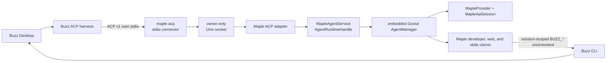
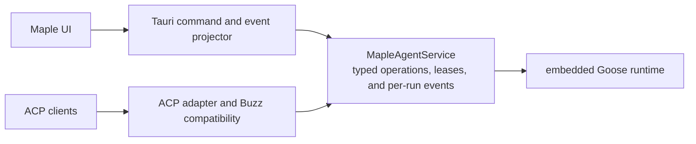

# Agent Mode ACP harness preview

This document describes Maple's experimental Agent Client Protocol (ACP) surface. The first tested consumer is [Buzz](https://github.com/block/buzz), but the architectural boundary is Maple-owned: external harnesses adapt into Maple's existing Agent Mode runtime rather than starting a second Goose runtime.

ACP is not Maple Agent's primary internal abstraction. Maple continues to embed Goose directly. The preview exists to answer a narrower question: can another local application control the real, signed-in Maple Agent through a standard agent protocol?

## Architecture



The packaged executable has two entry paths:

- Normal invocation launches Maple Desktop.
- `maple acp` connects standard input/output to the already-running desktop process.

Buzz owns the subprocess and supplies its relay context there. Maple Desktop owns authentication, the account-scoped provider, Goose managers, tasks, tools, permission policy, runs, and UI events. The connector sends no inference request itself and does not initialize a second agent runtime.

The executable path is part of the socket name. This keeps an installed Maple build and independent development builds from accidentally sharing an ACP endpoint.

## Why Goose ACP is not used directly

Goose already implements a much broader ACP server, including a reusable byte-stream transport. At Maple's pinned Goose revision, however, `GooseAcpAgent::new` creates and owns fresh session, permission, and agent managers and reads Goose's global configuration. Its public construction path cannot attach the ACP projection to Maple's existing managers.

Starting `goose acp`, enabling `goose serve`, or constructing a `GooseAcpAgent` after Maple initializes would therefore create a second runtime:


A provider factory alone is insufficient. Maple also needs to preserve:

- its authenticated `MapleApiSession` and caller-owned `MapleProvider`;
- account-scoped session storage and lifecycle fencing;
- model locking and session restoration behavior;
- `MapleDeveloperClient`, Maple web tools, and trust-filtered skills;
- Maple-local permission classification and approval UI;
- run cancellation, retained terminal state, and desktop timeline events; and
- ephemeral per-session tool context supplied by the external harness.

Sharing a data directory between two managers would not make them one runtime and would introduce conflicting in-memory ownership. The preview therefore uses the standard `agent-client-protocol` crate for a deliberately narrow mapping into Maple-owned operations.

## Current protocol surface

`No` means "not implemented by this preview," not "fundamentally impossible." Effort is relative to the current branch:

- **Low** is primarily ACP dispatch or projection over an existing Maple operation.
- **Medium** adds an account-scoped Maple runtime-facade operation, richer event contract, or lifecycle tests.
- **High** changes a security/product boundary or needs a broader structured-content/runtime abstraction. High does not necessarily imply a Buzz or Goose fork.

Goose already implements many of these semantics, but at Maple's pinned revision its history replayer, response builders, tool converters, permission mapping, usage mapping, and handlers are private or `pub(crate)` and operate on concrete `GooseAcpAgent` state. Maple can port that behavior, or Goose could extract it, but Maple cannot currently plug its host-owned runtime into those handlers.

| ACP operation or capability                | Preview support | Remaining effort                  | Feasibility and limiting layer                                                                                                                                                                                                                                                                                                                                                                                                                                                                                                                              |
| ------------------------------------------ | --------------- | --------------------------------- | ----------------------------------------------------------------------------------------------------------------------------------------------------------------------------------------------------------------------------------------------------------------------------------------------------------------------------------------------------------------------------------------------------------------------------------------------------------------------------------------------------------------------------------------------------------- |
| `initialize`                               | Yes             | Implemented                       | Negotiates ACP v1 and deliberately advertises only the narrow implemented capability set. New capabilities should be advertised only with their handlers and wire tests.                                                                                                                                                                                                                                                                                                                                                                                    |
| `session/new`                              | Yes             | Implemented                       | Requires an absolute `cwd` and creates a real Maple task. Optional additional workspace directories and generic ACP-provided MCP servers are graded separately below.                                                                                                                                                                                                                                                                                                                                                                                       |
| Additional workspace directories           | No              | Medium                            | Supportable, but Maple currently has a single-root task and Skills-trust model. Correct support needs canonical admission against the configured roots, an explicit per-session root set, tool and Skills semantics for those roots, and consistent persistence/reporting across list, load, resume, and fork. This is a Maple workspace-model change, not a Goose loop limitation.                                                                                                                                                                         |
| `session/prompt` text                      | Yes             | Implemented                       | Accepts text blocks and permits one active prompt per session. Text annotations are not currently preserved.                                                                                                                                                                                                                                                                                                                                                                                                                                                |
| `session/update` text and thought          | Partial         | Low–Medium                        | Assistant text and thought chunks are projected. Maple could incrementally add actual ACP variants such as user chunks, plans, available commands, modes/config, and session info. Full Goose fidelity is the sum of the richer tool, usage, and media rows below; Goose's mature projector cannot currently be called independently of `GooseAcpAgent`.                                                                                                                                                                                                    |
| `session/cancel`                           | Yes             | Implemented                       | Cancels Maple's underlying run and retains its terminal state.                                                                                                                                                                                                                                                                                                                                                                                                                                                                                              |
| `session/list`                             | No              | Low                               | Supportable without rearchitecture. Maple already lists account-scoped persisted tasks and can filter by `cwd`. The adapter needs ACP field mapping and pagination plus a policy decision: may a same-user ACP client enumerate all Desktop tasks, or only ACP-created tasks? Restricting by origin would first require durable provenance because preview tasks are ordinary Maple user tasks.                                                                                                                                                             |
| `session/resume`                           | No              | Medium                            | Supportable. Attach an existing same-account task without replay, validate its `cwd`, allowed roots, and active-run state, preserve its persisted model, and restore Maple provider/tool/permission state plus the current connection's transient environment. A service-global session lease is needed so two ACP clients cannot overwrite one task's credentials or tool context. This is a Maple lifecycle seam, not an agent-loop redesign.                                                                                                             |
| `session/load`                             | No              | Medium–High                       | Supportable. This is resume plus the protocol-required ordered replay before responding. Maple already loads a normalized timeline; faithful replay needs a separate ACP history projection for user/assistant/thought/tool rows, stable tool correlation, bounded content, and explicit treatment of media that Maple's UI timeline omits. Goose's existing replayer is useful upstream code to extract, but its activation path owns concrete Goose managers.                                                                                             |
| `session/close`                            | No              | Low–Medium                        | Supportable. Cancel active work, revoke connection-scoped credentials, release ACP ownership, and detach/unload only what ACP owns while preserving the persisted Maple task. The main work is race-safe cleanup without disrupting the same task if Maple Desktop is using it.                                                                                                                                                                                                                                                                             |
| `session/delete`                           | No              | Low code; high policy             | Maple already has a deletion operation, so the handler is straightforward. The product decision is consequential: whether ACP may destroy Desktop history, whether deletion is limited to ACP-created tasks, and whether an explicit opt-in is required.                                                                                                                                                                                                                                                                                                    |
| `session/fork`                             | No              | Medium                            | Goose's underlying `SessionManager` already has copy primitives, and its ACP implementation shows copy, optional truncation, and activation. Maple needs an account-scoped wrapper, root/policy validation, fresh transient context, activation, and rollback for partial failures. ACP fork is still unstable, so enabling it also accepts an unstable wire commitment; no Goose fork is otherwise required.                                                                                                                                               |
| Session mode                               | No              | Medium                            | Maple already changes per-session permission mode. ACP support needs advertised mode state, a handler, update projection, and an explicit rule about whether a client may select unattended approval. This is principally a Maple trust-policy decision.                                                                                                                                                                                                                                                                                                    |
| Model selection and other config           | No              | Medium–High                       | A Maple model option is feasible before the first prompt using Maple's authenticated catalog. Maple intentionally locks a task's model once it has history, so arbitrary mid-session switching should be rejected or treated as a product change. The native ACP path also needs authoritative vision/context metadata. Goose's config builder cannot be reused because it assumes Goose's global provider inventory rather than Maple's caller-owned `MapleProvider`; provider switching should remain out of scope.                                       |
| ACP permission requests                    | No              | High                              | Technically supportable, but it changes the trust boundary. Maple already exposes pending one-shot decisions and can feed a response back to Goose. It would need exactly one authoritative broker per session—Maple UI, ACP client, or a deliberately designed hybrid—plus timeout, disconnect, cancellation, and double-response handling. The tested Buzz build automatically chooses `allow_once` for forwarded requests, so delegation would materially weaken the current local-approval boundary. Goose's mapping is not an injectable broker.       |
| Basic structured tool calls and results    | No              | Low–Medium                        | Maple's timeline already carries stable IDs, title, input, output, status, and errors, which is enough for ordinary ACP `ToolCall` and `ToolCallUpdate` cards. This is mostly projection work. Buzz also treats the initial `tool_call` notification as activity, so projecting tool-call start would reset its idle watchdog during a long otherwise-silent tool, improving liveness as well as UI visibility.                                                                                                                                             |
| Rich tool/resource/location/MCP projection | No              | Medium–High                       | Rich image/resource content, file locations, progressive MCP notifications, and faithful replay need data below Maple's deliberately summarized UI timeline. A public transport-neutral Goose `AcpEventProjector` would avoid maintaining this nuanced mapping twice.                                                                                                                                                                                                                                                                                       |
| Terminal and diff parity                   | No              | Medium–High; architectural choice | Goose's terminal handles and diff updates are not projection alone: its ACP filesystem layer replaces/delegates developer operations through ACP-client filesystem and terminal RPCs. Maple currently executes its own local tools. Maple would need either to synthesize bounded metadata from those results or delegate execution to the client, which would change its tool and permission architecture; an event projector by itself is insufficient.                                                                                                   |
| Usage and context updates                  | No              | Medium                            | Supportable. Goose emits and persists usage, but Maple currently discards ephemeral usage notifications before its public event stream. Maple must retain a protocol-neutral usage event or query post-turn totals, pair usage with the persisted context limit, and define cumulative semantics. ACP cost is optional and should remain absent until it matches Maple billing semantics. Buzz can display standard usage for observability, but its durable turn-accounting path currently consumes a Goose-private cumulative-usage notification instead. |
| Prompt images                              | No              | Medium                            | The embedded Goose message model and `MapleProvider` already carry images. Maple's non-UI send facade is text-only and ACP forces `vision_capable: false`; support needs structured prompt input, MIME/base64/size limits, native model-capability resolution, and replay/UI policy. This is mainly a Maple facade change.                                                                                                                                                                                                                                  |
| Prompt audio                               | No              | High                              | Native audio is not a small adapter change. Pinned Goose has no audio message variant and its ACP conversion ignores audio. Maple could define a transcription-to-text pipeline, but native multimodal audio requires a Goose/provider/message abstraction change. This is the clearest current Goose-level content limitation.                                                                                                                                                                                                                             |
| Embedded text resources                    | No              | Low–Medium                        | Supportable by flattening bounded content into a clearly labeled, untrusted prompt block while preserving URI/provenance metadata.                                                                                                                                                                                                                                                                                                                                                                                                                          |
| Embedded binary resources                  | No              | Medium–High                       | Known image or document types could use explicit Maple ingestion paths. Arbitrary blobs have no generic model-facing representation and need type, decoding, size, staging, persistence, and rejection rules.                                                                                                                                                                                                                                                                                                                                               |
| Resource links                             | No              | Medium–High                       | Supportable with policy work, and currently a baseline ACP v1 gap because resource links have no opt-out capability. Local and remote links need separate scheme, root, symlink, size, encoding, permission, and provenance rules so prompt ingress cannot bypass Maple's filesystem/web controls. Goose's private helper only performs an unbounded local `file://` text read, which Maple should not copy literally.                                                                                                                                      |
| Arbitrary ACP-provided MCP servers         | No              | High                              | Technically supportable, but production-safe support expands a code-execution and secret boundary. Maple must validate client-supplied commands, URLs, headers, and environments; define authorization and name-collision rules; attach them transiently without persisting secrets; and guarantee per-session process cleanup across close, disconnect, crash, and Flatpak constraints. Generic stdio MCP is an ACP v1 baseline, so the current Buzz-only adaptation is a real conformance gap.                                                            |
| Goose/Buzz native steering                 | No              | Medium code; high coupling        | Supportable but intentionally non-standard. Buzz uses `_goose/unstable/session/steer`, not an ACP v1 method. Goose's underlying `Agent::steer` queue is public; Maple needs an active-agent/run facade, `expectedRunId` validation, correlation updates, and prompt-end/cancel race tests. Buzz's cancel-and-merge fallback means this is not required for the tested flow, and adopting it would couple Maple to an unstable extension.                                                                                                                    |

This is parity for the tested Maple task path, not parity with Goose's complete ACP implementation.

Two ACP v1 baseline caveats are worth making explicit: agents must accept `ResourceLink` prompt blocks and stdio MCP definitions. The preview handles neither generically. The tested Buzz custom-harness path uses text prompts and does not depend on arbitrary MCP definitions; Maple also contains one exact Buzz compatibility adaptation. Image, audio, and embedded-resource capabilities are correctly advertised as unavailable.

None of the `No` rows blocks the tested Buzz harness. That Buzz build does not call list/load/resume/fork/close, tolerates absent model/config options by using the agent default, and falls back from native steering to cancel-and-merge. Initial `tool_call` notifications would improve Buzz Desktop visibility and reset its idle watchdog during long tools. Standard usage would improve observability, while durable turn metrics currently rely on a Goose-private notification. Its signed channel reply remains a separate tool/CLI path.

## Maple-owned runtime service

The refactor exposes a transport-neutral Maple service around the existing embedded runtime:

- ensure the account-scoped runtime exists;
- create and delete a Maple task;
- send and cancel a run;
- consume an isolated, bounded event stream for one exact run;
- observe a retained terminal result when a run stream closes normally; and
- install and revoke per-session tool environments.

These are useful host capabilities independent of ACP. Protocol types remain in the ACP adapter rather than becoming Maple Agent domain types. The service owns account and shutdown admission fences, atomic session creation plus transient tool context, one active run per session, cancellation, cleanup, typed warnings/errors, and an ordered per-run event stream with a retained terminal result.



Tauri remains a thin projection of the existing Desktop contract: the original command names, arguments, result DTOs, `agent-event` envelopes, and frontend Agent Mode behavior are unchanged. ACP independently projects the same service operations and run events into ACP requests, notifications, and stop reasons. Socket ownership, protocol negotiation, connection leases, and `BUZZ_*` parsing remain adapter concerns.

This keeps Maple's domain model a useful superset instead of forcing Maple, Tauri, and ACP into exact wire parity. Neither adapter calls through the other, and the core service imports no Tauri or ACP types.

## Lifecycle and desktop configuration

The Agent connections settings surface is fail-closed and hidden by default. To expose it in a macOS or Linux Tauri Desktop development build, set the local Vite override in `frontend/.env.local` (or the build environment) and restart the frontend dev server:

```dotenv
VITE_FORCE_FEATURE_FLAGS=agent_connections
```

This preview gate uses only the local `VITE_FORCE_FEATURE_FLAGS` override; the remote feature-flag service cannot enable it. Web, mobile, and Windows builds keep both the navigation item and direct route unavailable even when the override is present.

The macOS/Linux desktop settings page is intentionally manual. It can:

- start and stop the local service;
- select the policy applied to newly created ACP sessions;
- show connected client, session, and active-run counts;
- copy the exact packaged executable path and `acp` argument;
- copy a Buzz custom-harness definition;
- show protocol, endpoint, and Buzz credential diagnostics; and
- warn that Buzz's default parallelism must be reduced to Maple's current default of one connection.

Maple stops ACP before logout, local Agent-data clearing, Agent-runtime stop or restart, application update restart, and application exit. A saved `enabled` value does not auto-start ACP on the next launch; the user must explicitly start it again.

Permission-mode, allowed-root, and maximum-connection changes require Stop, then change and save, then Start. This prevents a new session from racing a policy update and retaining the previous policy.

## Permissions are policy, not confinement

The persisted protocol-facing values currently have these meanings:

- `read_only` means **require local approvals**. Maple maps it to its `smart_approve` path. A write-capable action can still occur after the user approves it in Maple Desktop.
- `allow_all` is unattended operation. The agent may run commands, modify files, and perform external actions without a second local confirmation.

Neither mode is an operating-system sandbox.

Native configuration supports a list of allowed project roots, but the preview UI does not expose it. An empty list accepts any absolute session working directory available to the Maple process. Even a configured root checks session admission, not every path later accessed by a read, edit, or shell tool. Do not describe this as filesystem confinement.

## Local trust and credentials

The Unix socket is mode `0600`; the Linux runtime directory is owner-checked and mode `0700`. There is no second application-level client credential. While the service is enabled, any process running as the same OS user and able to reach that endpoint is inside the local trust boundary and can use the signed-in Maple Agent.

Maple and Buzz credentials follow different paths:

- Maple access credentials stay inside Maple Desktop's authenticated provider session. They are not written to the ACP harness, command arguments, or child environment.
- Buzz relay credentials begin in the Buzz-owned connector process. The connector sends an internal `_maple/bridge/hello` notification over the local socket before normal ACP traffic.
- The bridge filters to five `BUZZ_*` variables plus `PATH`, rejects null bytes, and rejects values over 16 KiB.
- Filtered values remain in the ACP connection's in-memory context and are copied into per-session tool context. Session installation revalidates the six-key allowlist and enforces the 16-KiB-per-value and 32-KiB-total bounds.
- The context is revoked during session and connection cleanup. Credential-bearing shells terminate their Unix process group or Windows Job Object immediately after each command to limit descendant retention. Forced async-task shutdown uses the same containment handle.

This design keeps Buzz credentials out of saved harness JSON, Maple configuration, argv, and Maple's process-global environment. It does **not** make the credentials invisible to the trusted agent or commands it runs. The shell needs the signing identity to publish a durable Buzz reply, and a command with that environment can inspect or transmit it. `allow_all` should therefore be enabled only for trusted clients, prompts, projects, and toolchains.

Unix process groups are not a complete sandbox: a command can deliberately call `setsid` or otherwise move a descendant into another process group before cleanup. Windows Job Objects provide stronger descendant containment. A hard Maple process crash or `SIGKILL` also bypasses Maple's in-process cleanup on both platforms, so a surviving descendant may retain an already copied credential. A portable hard credential boundary would require keeping the Buzz signing key out of arbitrary shell environments and exposing only a revocable Maple-owned broker or dedicated tool; that is outside this preview.

Credential-bearing Buzz shell execution fails closed inside Flatpak. Host-executable Linux packaging and socket behavior still require end-to-end validation.

## Buzz compatibility behavior

The wire surface is standard ACP v1, but this first adapter includes explicit Buzz compatibility:

- the private bridge hello for subprocess environment transfer;
- the Buzz relay variable allowlist;
- recognition of a narrowly shaped absolute `buzz-dev-mcp` stdio definition: matching server name and executable basename, no arguments, and an existing executable file;
- adaptation of that environment into Maple's existing developer shell instead of launching a second general-purpose shell server;
- a `Buzz ACP` Maple task title;
- custom-harness JSON and parallelism guidance in settings.

If this integration is maintained, these concerns should move behind an explicit Buzz adapter rather than expanding Maple's protocol-neutral runtime facade.

## End-to-end proof

The exploratory validation used:

- Maple with Goose pinned to `c3111c71cd682ed1d115741677f0ca9946c51499`;
- Buzz commit `3a4bf513df0e0c258587bfcbed9463d63723b56b`;
- a packaged arm64 macOS Maple development app;
- ACP v1;
- Buzz owner-only channel admission and parallelism `1`; and
- Maple's unattended `allow_all` policy.

Two Buzz GUI tasks completed:

1. A deterministic mention returned exactly `MAPLE-GUI-OK`.
2. A mention asked Maple to read the checkout's real `README.md` and explain the project. Maple used its local file tools and posted a substantive Buzz reply covering the Tauri/Bun architecture, platforms, TTS, PDF OCR, signing and updates, development prerequisites, and platform-specific setup notes.

The second run took roughly two to three minutes and ended with zero active runs. That timing has not been profiled and should not be attributed to ACP. The result is manual compatibility evidence, not a performance, load, conformance, billing, or security test.

## Known limitations

- macOS is the only platform validated end to end.
- Windows, mobile, and web are unsupported; non-Flatpak Linux remains unvalidated.
- Service activation is manual after every Maple launch.
- The local-approval mode publishes the ACP task and permission cards to Maple Desktop, which remains the authoritative approval broker. An unattended Buzz task can therefore wait for approval in Maple.
- Each ACP run has an isolated bounded event queue. If any event is dropped, Maple emits an explicit terminal error message and cancels the underlying run. It settles the already-admitted ACP turn without a JSON-RPC error because Buzz treats post-start agent errors as retryable and could otherwise repeat non-idempotent work; missed chunks are not reconstructed.
- Maple applies connection-wide backpressure to streamed `session/update` notifications: at most 256 updates and roughly 4 MiB may be in flight, and credit returns only after the complete line is written to the real local socket. A stalled client therefore blocks the adapter and eventually trips the core run's bounded event queue instead of growing the ACP dependency's internal notification queues. A single update larger than the byte limit is rejected and cancels that run. Ordinary JSON-RPC responses still bypass this Maple tracker and use `agent-client-protocol` 1.0.1's internally unbounded outgoing path, so a general release would still need an upstream bounded transport API or a request-admission limit; the validated same-user Buzz configuration uses parallelism `1`.
- An idle same-user socket can occupy the default one-connection limit; there is no initialization or idle timeout yet.
- Disconnecting keeps the Maple task, but ACP cannot reload it. Repeated connections can accumulate `Buzz ACP` tasks.
- Permission, root, and maximum-connection policy changes are rejected while the listener is running.
- The UI polls service status instead of subscribing to lifecycle events.
- There is no checked-in wire-level, socket-lifecycle, reconnect, permission, or Buzz GUI integration fixture yet.
- The adapter intentionally omits much of Goose's ACP event and capability surface.

## Maintenance recommendation

Keep Maple's primary path direct:

```text
Maple UI -> Maple runtime -> embedded Goose -> MapleProvider
```

Keep ACP at the edge:

```text
External harness -> ACP adapter -> Maple runtime facade
```

Maintaining the bounded adapter is reasonable if Buzz or other external harnesses are strategically useful. Maple should not duplicate Goose's full ACP feature set speculatively, refactor primary Agent Mode around ACP, or fork Goose solely for this preview.

Before broadening the local adapter, the preferred path is to pursue reusable Goose seams:

1. construct ACP around existing `AgentManager`, `SessionManager`, and `PermissionManager` handles;
2. use an injectable provider resolver for new, restored, and reconfigured sessions;
3. add host session-admission, activation, prompt-preparation, and cleanup hooks;
4. make permission routing pluggable between the host UI, ACP client, or a hybrid policy;
5. let a host preserve its installed developer/tool clients;
6. support transient ACP-provided session context with explicit cleanup;
7. extract the Goose-event-to-ACP projection for use without runtime ownership; and
8. remove global configuration and path assumptions from the embedded path.

Even with those changes, the small `maple acp` connector and local IPC boundary would remain: stdio and the Buzz-owned environment live in a spawned process, while Maple authentication lives in the running desktop process.
