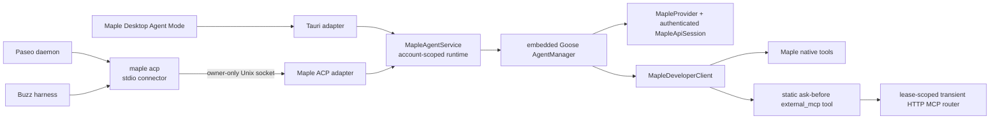
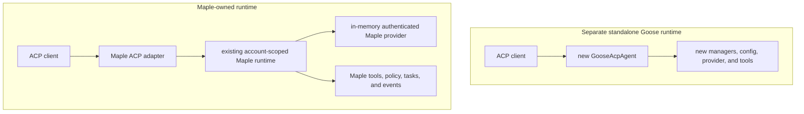
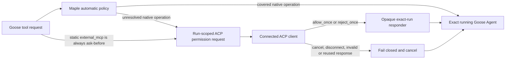

# Maple Agent Mode ACP adapter

Maple exposes an experimental [Agent Client Protocol (ACP)](https://agentclientprotocol.com/) edge adapter so a local client such as Paseo can control the signed-in Maple Agent. ACP is not Maple Agent Mode's internal abstraction: normal Desktop Agent Mode continues to call Maple's embedded Goose runtime directly.

This document describes the implementation in the current source tree. It does not by itself claim that a released Maple build includes the feature. The Paseo and native-Desktop checks in the validation matrix remain the release evidence.

## Architecture and ownership



The executable has separate entry paths:

- Normal invocation launches Maple Desktop.
- `maple acp` connects ACP stdio to the already-running Maple Desktop process.
- `maple --version` and `maple -V` print the version and exit without launching the GUI. Paseo uses this path for provider diagnostics.

The connector does not authenticate to Maple's API or create another Goose runtime. The running Desktop process owns the authenticated provider, account-scoped session manager, tools, permission policy, model catalog, and task history. The connector only bridges local stdio to that process.

The executable path is included in the local socket identity. An installed Maple build and an independent development build therefore do not accidentally share an ACP endpoint.

### Why Maple does not launch Goose ACP directly

At Maple's pinned Goose revision, the public Goose ACP construction path creates its own session, agent, permission, and configuration managers. It cannot attach its projection to Maple's existing account-scoped managers and caller-owned provider.

Launching `goose acp`, enabling `goose serve`, or creating a second `GooseAcpAgent` would split ownership:



Sharing a data directory would not make two in-memory managers one runtime. Maple instead keeps ACP protocol types in the edge adapter and exposes transport-neutral operations from `MapleAgentService`.

The service owns:

- account and shutdown admission fencing;
- creation, attachment, listing, and deletion of Maple tasks;
- one active run per task, cancellation, and retained terminal state;
- bounded per-run events and exact-run permission responders;
- model locking and task restoration;
- leased external tool context; and
- transient HTTP MCP setup, routing, revocation, and cleanup.

Tauri and ACP are sibling callers. Neither adapter calls through the other, and ACP changes must not make Desktop Agent Mode depend on ACP.

Maple Desktop's send-while-running behavior also remains Desktop-owned. It stages follow-ups in a per-task FIFO and advances them through sequential `Agent::reply` runs, with its own chip editing, steer, and Stop/Send fencing. ACP still permits only one active prompt per task and does not expose Goose's unstable steer method; Buzz continues to use its cancel-and-merge fallback.

## Setup with Paseo

Use the active authenticated Paseo daemon for end-to-end testing:

1. Launch the exact Maple build that Paseo will invoke and sign in.
2. Ensure Maple Agent Mode is running.
3. Enable the `agent_connections` feature and open **Settings -> Agent connections** in Maple.
4. Leave **ACP client decides** selected, save the policy if needed, and start the ACP service once.
5. In Paseo Desktop, add or edit a Generic ACP provider. Set Command to the exact Maple executable and add `acp` as its one separate argument.
6. Enable MCP-server support for that provider. Do not add a Maple API key or copy Maple credentials into Paseo.
7. Let Paseo discover Maple's authenticated model list and interactive mode. A static model list is unnecessary.
8. Keep both Desktop applications running while using the provider.

Keep the daemon's existing lifecycle intact. If provider configuration changes, reload or restart the same daemon instance that Paseo Desktop is connected to, then verify the Desktop reconnects before testing. Do not accidentally start a second daemon with a different lifecycle or state directory.

For local Maple development, expose the settings surface with:

```dotenv
VITE_FORCE_FEATURE_FLAGS=agent_connections
```

Restart the frontend development process after changing the flag. On macOS, use the executable belonging to the exact development app being tested; do not point Paseo at an installed release while validating a development build.

The settings surface is available only in macOS and Linux Tauri Desktop builds and is disabled by default. Web, mobile, and Windows builds do not expose it. The feature flag controls discovery of the settings page, not service activation. After the user starts ACP once, Maple persists that enabled choice and restores the listener after a later authenticated Desktop launch. **Stop service** persists the disabled choice and prevents that restoration.

The default maximum is eight simultaneous ACP connections. The current settings UI exposes neither that limit nor the allowed-project-root list. Its saved default has an empty root list, which accepts any absolute working directory Maple can access. The backend configuration still validates both fields, and changes require **Stop -> Save -> Start**, but the preview UI must not be described as a root-policy editor.

## Supported protocol surface

| ACP operation or behavior            | Support       | Notes                                                                                                              |
| ------------------------------------ | ------------- | ------------------------------------------------------------------------------------------------------------------ |
| `initialize`                         | Yes           | ACP v1; advertises load, list, close, HTTP MCP, text prompts, models, and one mode.                                |
| `session/new`                        | Yes           | Requires one admitted absolute `cwd`; additional directories are rejected.                                         |
| `session/prompt` text                | Yes           | One active prompt per task.                                                                                        |
| Prompt resource links                | URI text only | Maple adds the resource name and URI to the prompt; it does not fetch the resource or treat it as trusted content. |
| Prompt images                        | No            | Advertised as unsupported and rejected; Paseo's current attachment path does not supply a compatible ACP prompt.   |
| Prompt audio and embedded resources  | No            | Rejected rather than silently dropped.                                                                             |
| `session/update` text and thought    | Yes           | Bounded streaming notifications with stable message IDs.                                                           |
| Ordinary tool lifecycle              | Yes           | Stable tool IDs, start/update status, bounded input/output, and absolute file locations when available.            |
| Permission requests                  | Yes           | The ACP caller owns every unresolved decision for that run.                                                        |
| `session/cancel`                     | Yes           | Cancels the exact Maple run and retains terminal state.                                                            |
| `session/list`                       | Yes           | Same-account Read only/SmartApprove tasks, filtered by admitted root, in pages of at most 100.                     |
| `session/load`                       | Yes           | Loads only Read only/SmartApprove tasks, then acquires a lease and replays ordered visible history.                |
| `session/close`                      | Yes           | Uses one five-second deadline, revokes state on timeout, and deletes only a confirmed untouched provisional task.  |
| Session mode                         | Yes           | One caller-mediated `interactive` mode; no unattended Maple Auto mapping.                                          |
| Dynamic model catalog                | Yes           | Uses the authenticated Maple catalog and advertises an ACP model config option.                                    |
| End-of-turn token usage              | Yes           | Per-prompt-turn input/output/total and cache-token counts. No cost is invented.                                    |
| Streamable HTTP MCP                  | Loopback only | Plain HTTP through a direct lease-scoped `rmcp` client; no proxy, redirect, OAuth, registry, or persistence.       |
| Generic stdio MCP                    | No            | Rejected because it would execute caller-supplied native code without a Maple approval boundary.                   |
| Exact historical Buzz stdio bridge   | Yes           | Recognized only as a credential/context adaptation; Maple does not launch it as a generic transient server.        |
| SSE MCP                              | No            | Rejected. Streamable HTTP may itself carry protocol SSE events.                                                    |
| Goose/Buzz native steering           | No            | Desktop's staged queue and steer controls are not exposed as ACP methods; Buzz uses cancel-and-merge.              |
| `session/resume`, fork, and delete   | No            | Load covers Paseo import. ACP deletion remains a separate product-policy decision.                                 |
| Client-delegated terminal/filesystem | No            | Maple continues to execute its own local tools.                                                                    |

This is Paseo compatibility over Maple's real task path, not parity with every Goose ACP feature or unstable ACP extension.

## Provisional sessions and probe hygiene

Every task created by an external surface starts as Goose `SessionType::Acp`. It is a real persisted task so model configuration, tools, and the first prompt use the same Maple runtime path as any later turn, but it remains provisional while it has no admitted user message.

Zero-message ACP tasks are hidden from `session/list`. If `session/close` or connection cleanup sees a task that this connection created and never prompted, Maple deletes it only after the same-session operation has drained and core confirms that the durable row is still untouched. If that proof cannot complete within the cleanup bound, Maple revokes the lease but preserves the row rather than risking admitted work. Runtime startup sweeps an ACP-typed, zero-message task with no user rename or conversation that a crash or timed-out cleanup may have stranded. Renamed tasks, tasks with conversation content, and tasks with an admitted message survive. Once the first prompt is admitted, disconnect preserves the task for `session/list`, `session/load`, and Maple Desktop. A task loaded from existing history is never considered connection-created and is preserved even if the new connection never prompts it.

This rule is uniform for every admitted project directory. Maple does not special-case `$HOME`, Paseo's discovery directory, or any other path. Repeated Paseo model probes therefore do not require a HOME bypass and never appear in `session/list`; normal cleanup deletes them, while a crash or cleanup timeout is handled by the next runtime-start sweep.

Setup and teardown are race-aware:

- new/load, prompt, close, disconnect, runtime stop, and account change share lifecycle fences;
- a task cannot be attached by two external connections or attached while it has an active run;
- close gives cancellation, the same-session operation barrier, and lease cleanup one shared five-second deadline; if any phase misses it, Maple revokes the lease and retains a closing tombstone until connection teardown so late work cannot republish ownership; and
- disconnect revokes every capability synchronously before bounded asynchronous cleanup.

## Persisted tasks, load, and connection leases

Maple task history remains Maple-owned and account-scoped. Paseo uses ordinary Maple storage rather than a separate ACP database.

`session/list` optionally filters by an exact canonical `cwd`, rechecks every result against the saved allowed-root policy, sorts newest first, and returns a numeric cursor with at most 100 tasks per page. It exposes only tasks whose saved mode is Read only (`GooseMode::SmartApprove`). Desktop Auto tasks are omitted without being modified.

`session/load`:

1. verifies the task belongs to the active account;
2. requires the request `cwd` to match the task's canonical persisted root;
3. requires the task's saved mode to be Read only/SmartApprove, leaving Auto tasks unchanged for Maple Desktop;
4. rejects additional directories, an active run, another external lease, or a persisted model that has retired from the authenticated catalog;
5. connects the current request's transient HTTP MCP before committing ownership;
6. reconstructs the task using its persisted model and Maple tools; and
7. emits ordered visible user, assistant, thought, and tool history before returning the load response.

A connection lease is an opaque exact-match capability tied to one account, task, installation, and external surface. It prevents two ACP connections from overwriting one task's transient credentials or tool clients. Desktop can still view persisted history, but it does not receive an actionable permission card for a live ACP run.

For a durable task, `session/close` is not deletion. A clean close cancels the active ACP run, fails pending permissions closed, releases the lease, destroys the transient router and headers, unloads the cached agent, and leaves the task available to Desktop and a later `session/load`. If cancellation, the operation barrier, or exact-match lease cleanup exceeds the shared five-second deadline, Maple revokes the capability synchronously and returns without waiting indefinitely. It retains that session's operation registration and closing tombstone until connection teardown so a late load or prompt cannot republish ownership; dropped lease cleanup retries asynchronously. Deletion on close is limited to the connection's own still-unprompted provisional task after its operation barrier has drained and the durable row is confirmed untouched.

Runtime stop, logout, account change, application exit, and update restart also attempt ACP shutdown before tearing down the core Agent runtime.

## Models, modes, and usage

The model list comes from the authenticated `MapleApiSession`, not Goose's process-global provider inventory and not a static Paseo list. Non-chat entries such as embedding, transcription, speech, reranking, and image-generation models are filtered out. Maple's runtime default is always first and remains available if catalog refresh fails. Each ACP discovery attempt is cancellation-aware and has one 30-second total bound. The account generation and provider instance are rechecked after the network catalog request so a response from a signed-out account cannot be published into a replacement runtime.

Each session advertises a model config option in ACP's `model` category. Selection is allowed before the first message. Maple intentionally locks the model after a task has history; a mid-history change to a different model fails. When a persisted model is present, loading restores it exactly. If that locked model has retired from the current authenticated catalog, ACP rejects the load and leaves the task available in Maple Desktop rather than silently substituting the current default.

Maple does not expose a separate ACP thought-level control and does not invent one.

The adapter advertises one `interactive` mode in both ACP's mode state and config options. New ACP tasks use Maple's Read only/SmartApprove policy. Paseo may itself auto-select `allow_once` when it receives a permission request, but it cannot switch Maple into unattended Auto mode. Existing Desktop Auto tasks remain Auto and cannot be listed or loaded through ACP.

Core computes the token delta for each exact run from the persisted session's before/after usage. ACP returns that prompt turn's input, output, total, cache-read, and cache-write counts on the corresponding prompt response. It does not accumulate earlier turns into later responses, because Paseo records each response as `currentTurnUsage` and would otherwise double-count the session. Cost remains absent.

## Lease-scoped HTTP MCP

Paseo injects a Streamable HTTP MCP endpoint for per-agent controls and may include a connection-specific authorization header. Those values are credentials even when they are intended only for loopback.

Maple does not add this server to Goose's `ExtensionManager`. Instead:

1. the ACP adapter validates the definitions and creates a `SharedAgentToolContext` for the external lease;
2. a direct `rmcp` client connects and discovers a frozen tool catalog;
3. a lease-scoped router is installed in that shared context;
4. `MapleDeveloperClient` exposes one fixed `external_mcp` tool with a broadly compatible flat schema: a required exact tool ID enum plus a required arguments object; the wrapper description retains each frozen tool's sanitized description and argument contract;
5. an `external_mcp` call selects one exact ID, and `MapleDeveloperClient` routes it directly without registering the server's raw tools with Goose; and
6. lease revocation cancels requests, drops the router and headers, and unloads the cached Agent.

This path never enters Goose's extension registry, OAuth flow, credential store, configuration, or session-extension persistence. Transient names and secrets are not persisted even briefly.

The network and catalog boundary is deliberately narrow:

- at most 16 transient servers are accepted;
- URLs must use plain `http` with `localhost` or an explicit loopback IP; HTTPS and non-loopback hosts are rejected;
- URL credentials and fragments are rejected;
- the HTTP client disables ambient proxies and redirects;
- duplicate, malformed, newline-bearing, null-bearing, and oversized headers are rejected;
- the complete multi-server connection and catalog setup has one 30-second deadline;
- catalogs have page, tool-count, name, per-tool, and aggregate byte limits;
- exact router IDs are frozen as `<normalized-server>__<original-tool>` and appear only in the static wrapper's tool enum and catalog description; and
- expired MCP sessions are not reinitialized by replaying an in-flight tool request.

Sanitized tool descriptions and input schemas remain available in the static wrapper's frozen catalog description, but the raw transient tools are not added to Goose's model-facing catalog. The wrapper's actual input schema stays flat instead of using conditional JSON Schema branches that some OpenAI-compatible providers do not encode reliably. Server-supplied tool annotations, `_meta`, and icons are stripped. Result-level and content-level presentation metadata and annotations are also stripped. This prevents a transient server from using permission hints or host-active metadata to enter Maple's durable policy or UI state.

Tool calls have request and cancellation timeouts, protocol SSE events are capped, and the sanitized result is rejected if its serialized size exceeds 4 MiB. There is one known lower-layer gap: `rmcp` does not currently expose a pre-deserialization byte cap for an ordinary JSON response. Maple can enforce its semantic result limit only after that response has already been read and decoded. The loopback-only network boundary, 30-second request timeout, no-proxy client, and no-redirect policy reduce exposure but do not remove that allocation risk.

Generic stdio MCP is rejected before setup because starting an arbitrary command would be native code execution selected by the caller, before Maple could place the resulting tool use behind its approval boundary. The historical exact `buzz-dev-mcp` shape remains a special adaptation: Maple validates its absolute executable path, imports only the approved Buzz environment, and does not launch it as a transient server. Legacy SSE and every other MCP transport are rejected.

## Permissions are policy, not confinement

`read_only` is the retained serialized name for caller-mediated `smart_approve`; it is not a literal read-only sandbox. The legacy `allow_all` value is normalized to the same policy. Maple's user-facing task policy therefore remains caller-mediated and is persisted separately from internal Goose routing.

Maple keeps Goose in `SmartApprove`; it does not switch the live agent to Goose `Approve` or persist a lease-only mode. Maple's owned permission file marks the one static `external_mcp` tool as ask-before, so every external MCP call reaches Maple's `ActionRequired` handler regardless of server-supplied metadata. Maple can still resolve native operations covered by its own classifier; every unresolved native operation, and every `external_mcp` operation, is routed to the ACP caller.



The ACP caller is the sole interactive broker for that run. Maple Desktop receives no actionable live approval card. Cancellation, disconnect, an unknown choice, duplicate response, reused request ID, or transport failure fails closed.

Allowed project roots are admission policy, not filesystem confinement. An empty list accepts any absolute session working directory available to the Maple process. A configured root controls which task roots may be opened; it does not enforce every path later accessed by a read, edit, shell, skill, or MCP tool. The current settings UI does not expose this list.

## Prompt and event projection

Text prompt blocks are concatenated with separation. An ACP resource link contributes only visible text in the form of its resource name and URI. Maple does not dereference it, copy its bytes, grant it filesystem authority, or preserve additional resource metadata. Image, audio, and embedded-resource blocks are rejected. Image capability is advertised as false because Paseo's current attachment behavior does not produce a compatible prompt block for this adapter; this is not a claim that Maple's underlying model path lacks vision.

Live assistant text and thought chunks retain stable message IDs. The first row for a tool ID is projected as `tool_call`; later rows for that ID become `tool_call_update`, with status, bounded text, bounded raw input/output, inferred kind, and absolute file locations when Maple has one. Loading history uses the same projector and additionally includes visible user messages. For a coalesced completed, failed, or cancelled tool row, replay prefers the terminal `output.text` over the earlier request summary so Paseo displays the actual result while still receiving bounded raw input and output.

Each run has an isolated bounded event queue. A dropped event is not silently reconstructed: Maple emits a terminal error and cancels the exact underlying run.

Connection-wide admission permits at most 256 outstanding streamed updates and approximately 4 MiB of update/permission data. Notification credit returns only after the complete line is written to the local socket. Permission-request credit remains held until the caller responds or the connection closes. A stalled client therefore backpressures the adapter instead of accumulating unbounded frames.

Inbound newline-delimited ACP frames are limited to 10 MiB. Individual projected tool input/output is limited to 64 KiB, and errors are bounded before crossing the protocol.

## Local trust and credentials

On Unix, the ACP socket is mode `0600`; the Linux runtime directory is owner-checked and mode `0700`. There is no second Maple application credential. While the service is enabled, another process running as the same OS user and able to reach the endpoint is inside the local trust boundary and can control the signed-in Maple Agent.

Maple API credentials remain inside Maple Desktop's authenticated provider session. They are not copied into Paseo provider configuration, command arguments, or child environments.

Paseo's MCP authorization header lives only inside the leased HTTP client described above. It is cleared when the lease is revoked and never enters Maple or Goose configuration or task-extension storage.

Buzz relay credentials use a separate historical bridge:

- the Buzz-owned connector sends `_maple/bridge/hello` before normal ACP traffic;
- Maple accepts only five `BUZZ_*` values plus `PATH` with per-value and total bounds;
- values stay in the ACP connection's in-memory tool context; and
- session/connection cleanup revokes the context and terminates credential-bearing shells using the available process-containment primitive.

These controls limit accidental persistence and descendant retention; they are not a full sandbox. A trusted command can inspect credentials intentionally provided to its process, a Unix child can attempt to escape its process group, and a hard Maple crash can bypass in-process cleanup.

## Buzz compatibility history

Buzz was the first tested ACP consumer and remains a compatibility path, not the architecture's center. The implementation retains:

- the private bridge hello and Buzz relay-variable allowlist;
- exact recognition of `buzz-dev-mcp` and adaptation into Maple's developer shell;
- custom-harness fields and parallelism guidance in the settings UI; and
- post-start error settlement chosen to avoid Buzz retrying potentially non-idempotent work.

Historical manual validation used a packaged arm64 macOS Maple development app and Buzz commit `3a4bf513df0e0c258587bfcbed9463d63723b56b`. One task returned a deterministic marker; another read Maple's real `README.md`, used local tools, and posted a substantive reply. That is compatibility evidence only, not a conformance, security, load, billing, or performance result.

Paseo support must preserve this exact compatibility behavior without broadening private Buzz methods or credentials into Maple's protocol-neutral service.

## Validation matrix

The implementation is ready for review only when the applicable rows below have evidence.

| Layer                     | Required evidence                                                                                                                                                                                                                                                                                                                                                                                                                             |
| ------------------------- | --------------------------------------------------------------------------------------------------------------------------------------------------------------------------------------------------------------------------------------------------------------------------------------------------------------------------------------------------------------------------------------------------------------------------------------------- |
| Focused Rust tests        | ACP dispatch and wire types; root admission; resource-link flattening; model lock and retired-model rejection; SmartApprove-only list/load; provisional-task hiding/sweeping/deletion; bounded close and resurrection fences; terminal-tool replay result precedence; permission ownership; per-turn usage; tool lifecycle; static `external_mcp` schema/routing; HTTP MCP validation, cancellation, metadata stripping, and non-persistence. |
| Full Maple backend        | Nix-based checks and tests with the repository's Desktop ONNX runtime wrapper; no regression in existing Agent service, host lifecycle, developer client, or Tauri adapter tests.                                                                                                                                                                                                                                                             |
| Exact macOS Maple app     | Build and run the exact development app identity; sign in; create a native Desktop Agent task; stream a response; run a local tool; resolve a guarded permission; reload history; restart Agent Mode successfully.                                                                                                                                                                                                                            |
| Paseo Desktop diagnostics | The configured Maple executable returns promptly for `--version` without launching another GUI process.                                                                                                                                                                                                                                                                                                                                       |
| Paseo Desktop discovery   | The active authenticated daemon discovers the chat-model list and interactive mode within the cancellation/30-second bound; repeated refresh never lists and does not strand zero-message Maple tasks.                                                                                                                                                                                                                                        |
| Paseo basic task          | Create a task in an admitted project; select a model; receive text/thought; cancel one run; complete another; verify each response reports only that prompt turn's usage.                                                                                                                                                                                                                                                                     |
| Paseo tool task           | Observe ordinary tool start/progress/result events and file locations; an unresolved tool decision is owned only by Paseo.                                                                                                                                                                                                                                                                                                                    |
| Paseo persistence         | Close/disconnect preserves a prompted SmartApprove task; list/import finds it; load replays ordered history and terminal tool results before accepting a new prompt; Auto tasks stay Desktop-only; a retired locked model rejects load without fallback; closing the loaded session does not delete it; a stalled close returns within its bound without allowing late lease publication.                                                     |
| Paseo HTTP MCP            | The injected plain-loopback HTTP MCP connects; Goose sees one `external_mcp` tool with a required exact-ID enum and required arguments object; each call asks Paseo; headers and raw transient tools are absent from Maple/Goose configuration and task extensions; close/disconnect revokes the router.                                                                                                                                      |
| Negative security cases   | Reject relative/out-of-policy roots, additional directories, duplicate external leases, mid-history or retired model changes, images and other unsupported content, HTTPS/remote/redirecting MCP URLs, generic stdio/SSE, name collisions, malformed/oversized headers/catalogs/results, and disconnect during setup, calls, or permission.                                                                                                   |
| Regression after ACP      | Close the Paseo agent and stop Maple ACP, then repeat a native Desktop Agent task against the same Maple build. Verify no transient Paseo MCP tool or header appears in Desktop state.                                                                                                                                                                                                                                                        |

Use the same authenticated Paseo daemon for every row. If a provider refresh is required, reload that daemon through its configured lifecycle and verify Desktop reconnects before continuing.

The focused ACP test entry point on macOS is:

```bash
nix develop -c frontend/src-tauri/scripts/run-with-desktop-onnxruntime.sh \
  cargo test --manifest-path frontend/src-tauri/Cargo.toml agent_acp --lib
```

Use the managed OpenSecret workspace and its repository-native smoke commands for the supporting OpenSecret and billing services. Never substitute a different installed Maple app for the exact development app in the GUI rows.

## Known limitations and non-goals

- macOS is the only platform with historical end-to-end ACP evidence. Linux implementation paths have unit coverage but still require a real host-executable validation; Flatpak credential-bearing shell behavior fails closed.
- Windows, mobile, and web do not expose the service.
- Service activation is manual after each Maple launch.
- The settings UI does not expose allowed roots or the connection limit. Defaults are any absolute accessible root and eight connections.
- One active prompt is allowed per ACP task. An idle same-user client can consume one connection slot; there is no general initialization or idle timeout.
- Resource links are URI text only. Images, audio, embedded resources, client-delegated terminals/filesystems, additional workspace roots, fork, resume, and delete are unsupported. Paseo's current attachment path is why ACP image capability remains disabled here.
- Prompt usage is per turn and cost is absent.
- Transient MCP ordinary JSON responses do not have a pre-deserialization byte cap in the pinned `rmcp` transport. Semantic and serialized-result caps apply afterward.
- Maple intentionally projects a bounded subset of Goose's ACP behavior. Goose's complete projector remains coupled to its standalone runtime.
- The settings UI polls status instead of subscribing to service lifecycle events.
- A local owner-only socket and exact leases protect against cross-user and accidental cross-surface use; they do not protect the signed-in agent from a malicious process already running as the same OS user.

## Maintenance direction

Keep Maple's primary path direct:

```text
Maple UI -> Tauri adapter -> Maple runtime -> embedded Goose -> MapleProvider
```

Keep ACP at the edge:

```text
Paseo, Buzz, or another local client -> ACP adapter -> Maple runtime facade
```

Do not refactor native Agent Mode around ACP, start a second Goose runtime, or fork Goose merely to copy every ACP feature. Useful upstream Goose seams would be host-supplied managers and providers, invocation-scoped permission responders, transient session context with explicit cleanup, and a transport-neutral Goose-event-to-ACP projector. Even with those seams, Maple would retain its small `maple acp` connector because stdio belongs to the spawned client process while authentication belongs to the running Desktop process.
