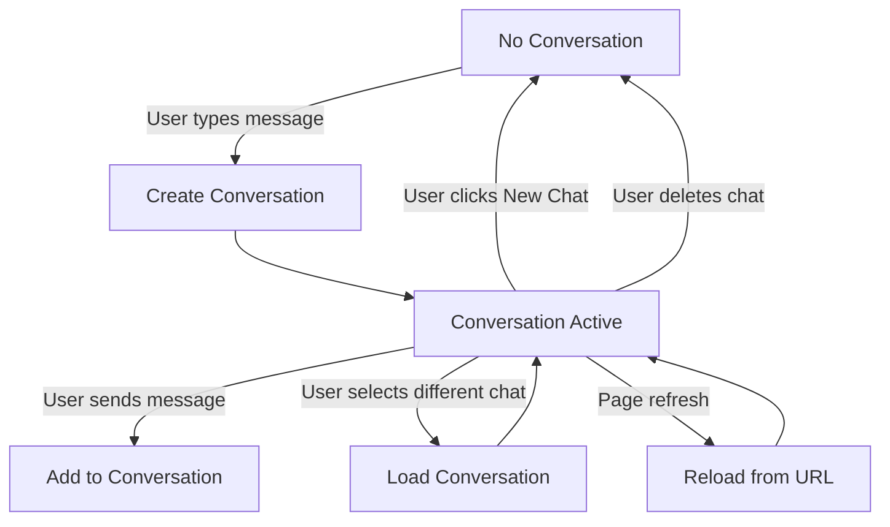

# Conversations/Responses API Implementation Guide

## Overview

This document describes the implementation of OpenAI's Conversations/Responses API in Maple's UnifiedChat component, building on the foundation established in [unified-chat-refactor.md](./unified-chat-refactor.md).

## Background

The Conversations/Responses API provides server-side conversation state management, replacing our previous localStorage-based approach. This migration enables:

- **Server-managed state**: Conversations persist across devices and sessions
- **Streaming responses**: Real-time AI responses via Server-Sent Events (SSE)
- **Stateless client**: No localStorage dependencies, pure server-driven state
- **Automatic context management**: Server handles conversation history and token limits

## Key Differences from POC

While the proof-of-concept in `responses-poc` demonstrates the API capabilities, our production implementation differs in several key ways:

1. **Component Architecture**: All logic stays in UnifiedChat.tsx (no Context providers)
2. **Title Generation**: Backend generates titles automatically (no frontend generation)
3. **Tool Support**: No web search or tool calling in initial implementation
4. **State Management**: Direct state in component, no external state libraries

## Technical Architecture

### API Endpoints

The OpenSecret backend provides OpenAI-compatible endpoints:

- **Conversations API**:
  - `POST /v1/conversations` - Create conversation
  - `GET /v1/conversations/{id}` - Get conversation
  - `PATCH /v1/conversations/{id}` - Update metadata
  - `DELETE /v1/conversations/{id}` - Delete conversation
  - `GET /v1/conversations/{id}/items` - List conversation items
  - `GET /v1/conversations` - List all conversations (custom extension)

- **Responses API**:
  - `POST /v1/responses` - Create response (with streaming)
  - `GET /v1/responses/{id}` - Get response status
  - `DELETE /v1/responses/{id}` - Delete response

### Client Setup

The SDK provides a custom fetch wrapper that handles:
- JWT authentication
- Session key encryption/decryption
- Automatic token refresh
- SSE streaming decryption

### Streaming Architecture

Responses use Server-Sent Events with the following event types:
- `response.created` - Response initiated
- `response.in_progress` - Processing started
- `response.output_item.added` - New output item
- `response.content_part.added` - Content part added
- `response.output_text.delta` - Text chunk
- `response.output_text.done` - Text complete
- `response.content_part.done` - Part complete
- `response.output_item.done` - Item complete
- `response.completed` - Response finished

## Implementation Plan

### Phase 1: Infrastructure Setup ✅ COMPLETE
1. ✅ Update OpenAI package to v5.20.0 (matched with SDK version)
2. ✅ OpenAI client already configured with custom fetch via context
3. ✅ Types added for conversations and responses

### Phase 2: Core Functionality ✅ COMPLETE
4. ✅ Implement conversation creation (lazy creation on first message)
5. ✅ Add message sending with streaming (using responses.create API)
6. ✅ Handle response streaming and display (all SSE events working)

### Phase 3: State Management ✅ COMPLETE
7. ✅ Add polling for conversation updates (5-second interval with cursor-based pagination)
8. ✅ Implement conversation loading from URL (loads on mount and URL changes)
9. ✅ Handle conversation switching (new chat clears conversation state)
10. ✅ Message deduplication (by ID and content signature)
11. ✅ LastSeenItemId tracking (React state-based cursor, no localStorage)
12. ✅ Handle browser navigation (back/forward button support)

### Phase 4: Integration ✅ COMPLETE
13. ✅ Update Sidebar to fetch from API (using OpenSecret SDK's listConversations)
14. ✅ Remove localStorage dependencies for chat data (all chat data now from API)
15. ✅ Add error handling and recovery (404 handling, network errors, streaming failures)
16. ✅ Fix redundant API calls (removed immediate polling after load)
17. ✅ Improve conversation switching reliability (proper state tracking)

## Completed Implementation Summary

### What Was Built (Phases 1-4 Complete)

The UnifiedChat component and Sidebar now have full Conversations/Responses API integration with the following features:

#### ✅ Core Conversation Management
- **Lazy conversation creation** - Conversations only created on first message to avoid clutter
- **URL-based routing** - Uses query parameters (`?conversation_id=xxx`) for conversation state
- **Automatic conversation loading** - Loads existing conversation when URL contains conversation_id
- **Event-based communication** - Listens for `newchat` and `conversationselected` events from sidebar

#### ✅ Streaming Implementation
- **Full SSE support** - Handles all streaming events from the responses API
- **Local to server ID mapping** - Smoothly transitions from local UUIDs to server-assigned IDs
- **Real-time text accumulation** - Shows text as it streams in
- **Status tracking** - Messages have `streaming`, `complete`, or `error` states
- **Abort controller** - Can cancel in-flight requests (foundation for future cancel button)

#### ✅ Polling & Synchronization
- **5-second polling interval** - Checks for new messages every 5 seconds
- **Cursor-based pagination** - Uses `after` parameter with `lastSeenItemId` for efficient polling
- **React state-based cursor** - No localStorage/sessionStorage, pure component state
- **Message deduplication** - Prevents duplicates using both ID and content signature matching
- **Cross-device sync** - Enables conversation continuity across devices

#### ✅ Error Handling
- **404 recovery** - Clears invalid conversation IDs and starts fresh
- **Network error display** - Shows user-friendly error messages
- **Silent polling failures** - Polling errors don't interrupt user experience
- **Streaming error handling** - Gracefully handles streaming failures

#### ✅ State Management
- **No localStorage for chat data** - All conversation state comes from the API
- **Proper cleanup** - Clears state when switching conversations or starting new chats
- **TypeScript compliant** - Fully typed with proper error handling

### What Still Needs Work (Phase 4)

1. **Sidebar Integration** - Currently still uses localStorage, needs to fetch from API
2. **Legacy Chat Migration** - Strategy for handling old localStorage-based chats
3. **Advanced Features** - Model selection, token management, file attachments, etc.

### Key Technical Decisions Made

1. **Cursor-based Polling with React State**
   - The `lastSeenItemId` is stored in component state, not localStorage
   - Resets on page refresh (loads all messages fresh)
   - Updates after each poll and after streaming completes
   - Simple and effective for maintaining position during a session

2. **Message ID Management**
   - User messages get client-side UUIDs immediately
   - Assistant messages start with local UUIDs, then swap to server IDs
   - Deduplication handles the transition gracefully
   - Prevents flicker and maintains smooth UX

3. **Error Recovery Strategy**
   - 404s clear the conversation and remove invalid ID from URL
   - Network errors show user message but don't break the app
   - Polling failures are silent (logged to console only)
   - Streaming errors mark the message with error state

4. **Event-Driven Architecture**
   - Custom events for sidebar communication (`newchat`, `conversationselected`)
   - Avoids prop drilling and complex state management
   - Keeps components loosely coupled

## Implementation Details

### 1. Package Updates

Update OpenAI SDK to support conversations API:

```json
{
  "dependencies": {
    "openai": "^5.20.0"  // Updated from 4.56.1 to match SDK version exactly
  }
}
```

The v5+ SDK includes full support for:
- Conversations API (create, retrieve, update, delete, list items)
- Responses API (create with streaming, retrieve, delete)
- Proper TypeScript types for all new endpoints
- Streaming iterator support for SSE events

### 2. OpenAI Client Configuration

Create client with OpenSecret's custom fetch from the SDK:

```typescript
import { createCustomFetch } from "@opensecret/react";
import OpenAI from "openai";

// Get API URL from environment
const API_URL = import.meta.env.VITE_OPEN_SECRET_API_URL || "https://api.opensecret.cloud";

// Create OpenAI client with custom fetch
const openai = new OpenAI({
  baseURL: `${API_URL}/v1/`,
  dangerouslyAllowBrowser: true,  // Required for browser usage
  apiKey: "not-needed",           // Auth handled by custom fetch
  defaultHeaders: {
    "Accept-Encoding": "identity"  // Disable compression for SSE
  },
  fetch: createCustomFetch()       // SDK's custom fetch handles auth & encryption
});
```

The custom fetch from `@opensecret/react` handles:
- JWT token injection from localStorage
- Automatic token refresh on 401
- Session key encryption/decryption for E2E encryption
- Proper error handling with retry logic

### 3. Complete Type Definitions

Based on the actual API responses and SDK implementation:

```typescript
// Core conversation types
interface Conversation {
  id: string;
  object: "conversation";
  created_at: number;  // Unix timestamp
  metadata?: {
    title?: string;    // Auto-generated by backend
    [key: string]: any;
  };
}

// Conversation item types
interface ConversationItem {
  id: string;
  type: "message" | "web_search_call";  // Extensible for tools
  object?: string;
  role?: "user" | "assistant" | "system";
  status?: "completed" | "in_progress";
  content?: Array<{
    type: "text" | "input_text";
    text?: string;
  }>;
  created_at?: number;
}

// Message type for UI rendering
interface Message {
  id: string;
  role: "user" | "assistant" | "system";
  content: string;
  timestamp: number;
  status: "complete" | "streaming" | "error";
  isStreaming?: boolean;
}

// Response streaming event types
interface ResponseEvent {
  type:
    | "response.created"
    | "response.in_progress"
    | "response.output_item.added"
    | "response.content_part.added"
    | "response.output_text.delta"
    | "response.output_text.done"
    | "response.content_part.done"
    | "response.output_item.done"
    | "response.completed"
    | "response.failed"
    | "error";

  // Event-specific fields
  sequence_number?: number;
  delta?: string;           // For text deltas
  item_id?: string;         // ID of the item being streamed
  item?: any;               // Full item for added events
  response?: {              // Full response object for created/completed
    id: string;
    status: "in_progress" | "completed" | "failed";
    model?: string;
    usage?: {
      input_tokens: number;
      output_tokens: number;
      total_tokens: number;
    };
    output?: Array<any>;
  };
  error?: {
    message: string;
    type: string;
    code?: string;
  };
}

// API list response format
interface ConversationListResponse {
  object: "list";
  data: Conversation[];
  first_id?: string;
  last_id?: string;
  has_more: boolean;
}

// Conversation items cursor pagination
interface ConversationItemsPage {
  data: ConversationItem[];
  has_more: boolean;
  first_id?: string;
  last_id?: string;
}
```

### 4. Complete Conversation Lifecycle Management

Managing conversation lifecycle is critical for a seamless user experience. Here's the complete implementation:

```typescript
// Full conversation lifecycle implementation
const ConversationManager = () => {
  const [conversation, setConversation] = useState<Conversation | null>(null);
  const [messages, setMessages] = useState<Message[]>([]);
  const [lastSeenItemId, setLastSeenItemId] = useState<string>();

  // 1. CREATE NEW CONVERSATION
  const createConversation = async () => {
    try {
      // Don't pre-create conversations - wait for first message
      // This avoids empty conversations cluttering the list
      setConversation(null);
      setMessages([]);
      setLastSeenItemId(undefined);

      // Clear URL parameter for new chat
      const params = new URLSearchParams(window.location.search);
      params.delete("conversation_id");
      const newUrl = params.toString() ? `/?${params}` : "/";
      window.history.replaceState({}, "", newUrl);
    } catch (error) {
      handleAPIError(error, "Create conversation");
    }
  };

  // 2. LAZY CONVERSATION CREATION ON FIRST MESSAGE
  const ensureConversation = async (): Promise<string> => {
    if (conversation?.id) {
      return conversation.id;
    }

    // Create conversation on demand
    const newConv = await openai.conversations.create({
      metadata: {
        // Backend will auto-generate title from first message
        // No need to set title here
      }
    });

    setConversation({
      id: newConv.id,
      object: "conversation",
      created_at: newConv.created_at,
      metadata: newConv.metadata
    });

    // Update URL with new conversation ID
    const params = new URLSearchParams(window.location.search);
    params.set("conversation_id", newConv.id);
    window.history.replaceState({}, "", `/?${params}`);

    return newConv.id;
  };

  // 3. LOAD EXISTING CONVERSATION
  const loadConversation = async (conversationId: string) => {
    try {
      // Fetch conversation metadata
      const conv = await openai.conversations.retrieve(conversationId);
      setConversation(conv);

      // Fetch all conversation items
      const itemsResponse = await openai.conversations.items.list(conversationId, {
        limit: 100 // Get up to 100 most recent items
      });

      // Convert items to messages
      const loadedMessages: Message[] = [];

      for (const item of itemsResponse.data) {
        if (item.type === "message" && item.role && item.content) {
          let text = "";
          if (Array.isArray(item.content)) {
            for (const part of item.content) {
              if (part.type === "text" || part.type === "input_text") {
                text += part.text || "";
              }
            }
          } else if (typeof item.content === "string") {
            text = item.content;
          }

          loadedMessages.push({
            id: item.id,
            role: item.role as "user" | "assistant",
            content: text,
            timestamp: item.created_at ? item.created_at * 1000 : Date.now(),
            status: "complete"
          });
        }
      }

      setMessages(loadedMessages);

      // Set last seen ID for polling
      if (itemsResponse.data.length > 0) {
        const lastItem = itemsResponse.data[itemsResponse.data.length - 1];
        setLastSeenItemId(lastItem.id);
      }

      // Update URL if needed
      const params = new URLSearchParams(window.location.search);
      if (params.get("conversation_id") !== conversationId) {
        params.set("conversation_id", conversationId);
        window.history.replaceState({}, "", `/?${params}`);
      }
    } catch (error: any) {
      if (error.status === 404) {
        // Conversation doesn't exist - clear and start fresh
        console.log("Conversation not found, starting new");
        createConversation();
      } else {
        handleAPIError(error, "Load conversation");
      }
    }
  };

  // 4. DELETE CONVERSATION
  const deleteConversation = async (conversationId: string) => {
    try {
      await openai.conversations.delete(conversationId);

      // If deleting current conversation, start fresh
      if (conversation?.id === conversationId) {
        createConversation();
      }
    } catch (error) {
      handleAPIError(error, "Delete conversation");
    }
  };

  // 5. HANDLE URL CHANGES (on mount and popstate)
  useEffect(() => {
    const handleUrlChange = () => {
      const params = new URLSearchParams(window.location.search);
      const conversationId = params.get("conversation_id");

      if (conversationId && conversationId !== conversation?.id) {
        // Load the conversation from URL
        loadConversation(conversationId);
      } else if (!conversationId && conversation?.id) {
        // URL cleared - start new conversation
        createConversation();
      }
    };

    // Initial load
    handleUrlChange();

    // Listen for browser back/forward
    window.addEventListener("popstate", handleUrlChange);
    return () => window.removeEventListener("popstate", handleUrlChange);
  }, []);

  // 6. HANDLE NEW CHAT EVENT FROM SIDEBAR
  useEffect(() => {
    const handleNewChat = () => {
      createConversation();
    };

    window.addEventListener("newchat", handleNewChat);
    return () => window.removeEventListener("newchat", handleNewChat);
  }, []);

  return {
    conversation,
    messages,
    ensureConversation,
    loadConversation,
    deleteConversation,
    createConversation
  };
};
```

#### Conversation State Transitions



#### Important Lifecycle Considerations

1. **Lazy Creation**: Don't create conversations until first message
2. **URL Sync**: Always keep URL in sync with active conversation
3. **Browser Navigation**: Handle back/forward buttons properly
4. **Cross-Device**: Polling ensures continuity across devices
5. **Error Recovery**: Handle missing conversations gracefully
6. **Title Generation**: Backend generates titles automatically from first message

### 5. Detailed Streaming Event Handling

The responses API uses Server-Sent Events (SSE) for streaming. Here's the complete event flow and handling:

```typescript
// Complete streaming implementation based on POC
const sendMessage = async (userInput: string, conversationId: string) => {
  // Create abort controller for cancellation
  const abortController = new AbortController();

  try {
    // Create streaming response
    const stream = await openai.responses.create({
      model: "ibnzterrell/Meta-Llama-3.3-70B-Instruct-AWQ-INT4", // Or user's selected model
      conversation: conversationId,
      input: [{ role: "user", content: userInput }],
      stream: true,        // Enable streaming
      store: true,         // Store in conversation history
      background: true,    // Continue processing in background
      signal: abortController.signal
    });

    // Initialize assistant message
    // NOTE: The POC used local UUID -> server ID swap pattern
    // This is complicated and error-prone (see alternatives below)
    const localAssistantId = crypto.randomUUID();
    let serverItemId: string | undefined;
    let accumulatedContent = "";

    const assistantMessage: Message = {
      id: localAssistantId,
      role: "assistant",
      content: "",
      timestamp: Date.now(),
      status: "streaming"
    };

    // Add to messages immediately
    setMessages(prev => [...prev, assistantMessage]);

    // Process streaming events
    for await (const event of stream) {
      switch (event.type) {
        case "response.created":
          // Response object created, contains initial metadata
          console.log("Response started:", event.response?.id);
          break;

        case "response.in_progress":
          // Processing has begun
          break;

        case "response.output_item.added":
          // New output item added (message or tool call)
          if (event.item?.type === "message" && event.item_id) {
            serverItemId = event.item_id;
            // PROBLEMATIC: Update local message ID to server ID
            // This causes re-renders and complicates message tracking
            setMessages(prev => prev.map(msg =>
              msg.id === localAssistantId
                ? { ...msg, id: serverItemId || msg.id }
                : msg
            ));
          }
          break;

        case "response.content_part.added":
          // Content part initialized (before text starts)
          break;

        case "response.output_text.delta":
          // Text chunk received - this is the main event for streaming text
          if (event.delta) {
            accumulatedContent += event.delta;
            // Update message content in real-time
            setMessages(prev => prev.map(msg =>
              msg.id === (serverItemId || localAssistantId)
                ? { ...msg, content: accumulatedContent }
                : msg
            ));
          }
          break;

        case "response.output_text.done":
          // Text streaming complete for this part
          break;

        case "response.content_part.done":
          // Content part finished
          break;

        case "response.output_item.done":
          // Output item complete
          if (event.item?.type === "message") {
            // Finalize the message
            setMessages(prev => prev.map(msg =>
              msg.id === (serverItemId || localAssistantId)
                ? { ...msg, status: "complete" }
                : msg
            ));
          }
          break;

        case "response.completed":
          // Entire response complete, includes usage stats
          if (event.response?.usage) {
            console.log("Token usage:", event.response.usage);
          }
          setIsGenerating(false);
          // Update last seen item ID for polling
          if (serverItemId) {
            setLastSeenItemId(serverItemId);
          }
          break;

        case "response.failed":
        case "error":
          // Handle streaming errors
          console.error("Streaming error:", event.error);
          setMessages(prev => prev.map(msg =>
            msg.id === (serverItemId || localAssistantId)
              ? { ...msg, status: "error" }
              : msg
          ));
          setIsGenerating(false);
          break;
      }
    }
  } catch (error) {
    if (error.name !== 'AbortError') {
      console.error("Failed to send message:", error);
      throw error;
    }
  }
};

// Cancel generation function
const cancelGeneration = () => {
  abortController?.abort();
  setIsGenerating(false);
};
```

#### Event Sequence Details

The typical event sequence for a streaming response:

1. **response.created** - Initial response object with ID and metadata
2. **response.in_progress** - Processing begins
3. **response.output_item.added** - Message item added to response
4. **response.content_part.added** - Text content part initialized
5. **response.output_text.delta** - Multiple events with text chunks
6. **response.output_text.done** - Text generation complete
7. **response.content_part.done** - Content part finalized
8. **response.output_item.done** - Message item complete
9. **response.completed** - Full response done with usage stats

#### Important Streaming Considerations

- **Server Item IDs**: Messages get server-assigned IDs during streaming
- **Local vs Server IDs**: Start with local UUID, replace with server ID when available
- **Abort Handling**: Use AbortController for clean cancellation
- **Error Recovery**: Handle network interruptions gracefully
- **Token Usage**: Track usage from completed event for billing

#### Problems with Local ID → Server ID Pattern

The POC's approach of swapping IDs has several issues:

1. **Complex State Updates**: Requires finding and updating messages by temporary ID
2. **Deduplication Issues**: Polling might see same message with different IDs
3. **React Re-rendering**: Changing keys causes unnecessary re-renders
4. **Race Conditions**: Polling might return before ID swap completes

#### Alternative Approaches to Consider

**Option 1: Use Array Index Instead of ID**
```typescript
// Track by position, not ID
const assistantMessageIndex = messages.length;
setMessages(prev => [...prev, assistantMessage]);
// Update by index, not ID
setMessages(prev => prev.map((msg, idx) =>
  idx === assistantMessageIndex ? {...msg, content: newContent} : msg
));
```

**Option 2: Compound Key**
```typescript
// Use both IDs as a compound key
const messageKey = `${localId}_${serverId || 'pending'}`;
```

**Option 3: Separate Streaming Message State**
```typescript
const [streamingMessage, setStreamingMessage] = useState<Message | null>(null);
const [persistedMessages, setPersistedMessages] = useState<Message[]>([]);
// Only add to persisted when complete with server ID
```

**Option 4: Use Response ID from First Event**
```typescript
// response.created event includes response.id immediately
// Could use this instead of waiting for item_id
```

**Recommendation**: Further investigation needed to determine the cleanest approach. The array index method might be simplest but needs testing with the polling mechanism.

### 6. Comprehensive Polling Mechanism

The polling system ensures conversation continuity across sessions and devices. This is critical for:
- **Mid-stream refreshes**: User refreshes while AI is responding
- **Cross-device sync**: Continue conversation from another device
- **Background updates**: Catch responses that completed after network issues
- **Missed events**: Recover from temporary disconnections

```typescript
// Complete polling implementation based on POC
const pollForNewItems = useCallback(async () => {
  if (!conversationId || !openai) return;

  try {
    // Fetch items after the last seen ID
    const response = await openai.conversations.items.list(conversationId, {
      after: lastSeenItemId,
      limit: 100  // Get up to 100 new items
    });

    if (response.data.length > 0) {
      // Convert API items to UI messages
      const newMessages: Message[] = [];

      for (const item of response.data) {
        if (item.type === "message" && item.role && item.content) {
          // Extract text content from content array
          let text = "";
          if (Array.isArray(item.content)) {
            for (const part of item.content) {
              if (typeof part === "object" && part.text) {
                text += part.text;
              }
            }
          }

          const message: Message = {
            id: item.id,
            role: item.role as "user" | "assistant",
            content: text,
            timestamp: item.created_at ? item.created_at * 1000 : Date.now(),
            status: "complete"
          };

          newMessages.push(message);
        }
      }

      if (newMessages.length > 0) {
        // Merge new messages with deduplication
        setMessages(prev => {
          const existingIds = new Set(prev.map(m => m.id));
          const existingSignatures = new Set(
            prev.map(m => `${m.role}:${m.content.substring(0, 100)}`)
          );

          const uniqueNewMessages = newMessages.filter(m => {
            // Skip if we already have this ID
            if (existingIds.has(m.id)) return false;

            // Skip if we have a message with same role and similar content
            const signature = `${m.role}:${m.content.substring(0, 100)}`;
            if (existingSignatures.has(signature)) return false;

            return true;
          });

          if (uniqueNewMessages.length === 0) return prev;

          // Replace local messages with server versions when they match
          const updatedMessages = prev.map(msg => {
            // If this is a local message (UUID format)
            if (msg.id.includes("-") && msg.id.length === 36) {
              const serverVersion = uniqueNewMessages.find(
                newMsg => newMsg.role === msg.role && newMsg.content === msg.content
              );
              if (serverVersion) {
                // Remove from unique list to avoid duplication
                uniqueNewMessages.splice(uniqueNewMessages.indexOf(serverVersion), 1);
                return { ...msg, id: serverVersion.id };
              }
            }
            return msg;
          });

          return [...updatedMessages, ...uniqueNewMessages];
        });

        // Update last seen item ID
        const lastItem = response.data[response.data.length - 1];
        if (lastItem?.id) {
          setLastSeenItemId(lastItem.id);
        }

        // Check if we're no longer generating
        if (isGenerating && newMessages.some(m => m.role === "assistant")) {
          setIsGenerating(false);
        }
      }
    }
  } catch (error) {
    console.error("Polling error:", error);
    // Don't throw - polling should fail silently
  }
}, [conversationId, lastSeenItemId, isGenerating, openai]);

// Set up polling interval
useEffect(() => {
  if (!conversationId || !openai) return;

  // Poll immediately on mount/change
  pollForNewItems();

  // Then set up interval for every 5 seconds
  const intervalId = setInterval(pollForNewItems, 5000);

  return () => clearInterval(intervalId);
}, [conversationId, openai, pollForNewItems]);
```

#### Polling Strategy Details

1. **Cursor-based Pagination**: Uses `after` parameter with last seen item ID
2. **Immediate Poll**: Polls immediately when conversation loads or changes
3. **5-Second Interval**: Balances freshness with server load
4. **Silent Failures**: Polling errors don't interrupt user experience
5. **Automatic Stop**: Clears interval on unmount or conversation change

#### Message Deduplication

The polling system includes sophisticated deduplication:

```typescript
// Deduplication strategy
const deduplicateMessages = (existing: Message[], incoming: Message[]) => {
  // 1. Check by ID (server-assigned IDs)
  const existingIds = new Set(existing.map(m => m.id));

  // 2. Check by content signature (for local messages not yet synced)
  const existingSignatures = new Set(
    existing.map(m => `${m.role}:${m.content.substring(0, 100)}`)
  );

  // 3. Filter incoming messages
  const unique = incoming.filter(m => {
    if (existingIds.has(m.id)) return false;

    const signature = `${m.role}:${m.content.substring(0, 100)}`;
    if (existingSignatures.has(signature)) return false;

    return true;
  });

  // 4. Replace local IDs with server IDs when messages match
  const updated = existing.map(msg => {
    if (msg.id.includes("-")) { // Local UUID
      const serverMatch = unique.find(
        u => u.role === msg.role && u.content === msg.content
      );
      if (serverMatch) {
        unique.splice(unique.indexOf(serverMatch), 1);
        return { ...msg, id: serverMatch.id };
      }
    }
    return msg;
  });

  return [...updated, ...unique];
};
```

### 7. Simple Error Handling

Keep error handling straightforward - just show what went wrong:

```typescript
// Basic error handling
const handleAPIError = (error: any) => {
  console.error("API Error:", error);

  if (error.status === 401) {
    // Auth failed - let the SDK handle refresh
    // If we still get 401, redirect to login
    window.location.href = "/login";
    return;
  }

  if (error.status === 404) {
    // Conversation not found - clear and start fresh
    setError("Conversation not found");
    const params = new URLSearchParams(window.location.search);
    params.delete("conversation_id");
    window.history.replaceState({}, "", "/");
    return;
  }

  if (error.name === "AbortError") {
    // User cancelled - don't show error
    return;
  }

  // Show generic error for everything else
  setError(error.message || "Something went wrong. Please try again.");
  setIsGenerating(false);
};

// Simple usage
const sendMessage = async (input: string) => {
  try {
    // ... send message code ...
  } catch (error) {
    handleAPIError(error);
  }
};
```

#### Error Display in UI

```typescript
// Simple error state
const [error, setError] = useState<string | null>(null);

// Show error banner
{error && (
  <div className="bg-red-50 text-red-600 p-3 rounded mb-4">
    {error}
  </div>
)}

// Auto-clear after 10 seconds
useEffect(() => {
  if (error) {
    const timer = setTimeout(() => setError(null), 10000);
    return () => clearTimeout(timer);
  }
}, [error]);
```

**Note**: No retry logic or exponential backoff for now. Keep it simple - if something fails, show an error and let the user try again manually.

### 8. State Structure

Maintain minimal, server-driven state:

```typescript
const [conversation, setConversation] = useState<Conversation | null>(null);
const [messages, setMessages] = useState<Message[]>([]);
const [isStreaming, setIsStreaming] = useState(false);
const [lastSeenItemId, setLastSeenItemId] = useState<string>();
```

### 9. Sidebar Integration Updates

The Sidebar component needs significant updates to work with the conversations API instead of localStorage:

```typescript
// Current sidebar uses localStorage
const currentImplementation = {
  storage: "localStorage",
  key: "maple_chats",
  format: "JSON array of chat objects"
};

// New implementation with conversations API
const SidebarWithConversationsAPI = () => {
  const [conversations, setConversations] = useState<Conversation[]>([]);
  const [isLoading, setIsLoading] = useState(true);

  // Fetch conversations from API
  const loadConversations = async () => {
    try {
      setIsLoading(true);

      // Use custom list function from SDK (non-standard OpenAI extension)
      const response = await fetch(`${API_URL}/v1/conversations?limit=50`, {
        headers: {
          Authorization: `Bearer ${localStorage.getItem("access_token")}`,
          "Content-Type": "application/json"
        }
      });

      if (!response.ok) throw new Error("Failed to fetch conversations");

      const data: ConversationListResponse = await response.json();

      // Sort by created_at descending (newest first)
      const sorted = data.data.sort((a, b) => b.created_at - a.created_at);
      setConversations(sorted);
    } catch (error) {
      console.error("Failed to load conversations:", error);
      setConversations([]);
    } finally {
      setIsLoading(false);
    }
  };

  // Load on mount
  useEffect(() => {
    loadConversations();
  }, []);

  // Refresh when conversation changes
  useEffect(() => {
    const handleConversationUpdate = () => {
      loadConversations();
    };

    window.addEventListener("conversationupdated", handleConversationUpdate);
    return () => window.removeEventListener("conversationupdated", handleConversationUpdate);
  }, []);

  // Handle conversation selection
  const selectConversation = (conversationId: string) => {
    // Update URL to load conversation
    const params = new URLSearchParams(window.location.search);
    params.set("conversation_id", conversationId);
    window.history.replaceState({}, "", `/?${params}`);

    // Dispatch event for UnifiedChat to handle
    window.dispatchEvent(new CustomEvent("conversationselected", {
      detail: { conversationId }
    }));
  };

  // Handle new chat
  const createNewChat = () => {
    // Clear URL parameter
    const params = new URLSearchParams(window.location.search);
    params.delete("conversation_id");
    window.history.replaceState({}, "", params.toString() ? `/?${params}` : "/");

    // Dispatch event for UnifiedChat
    window.dispatchEvent(new Event("newchat"));
  };

  // Handle delete
  const deleteConversation = async (conversationId: string, e: React.MouseEvent) => {
    e.stopPropagation(); // Don't select the conversation

    try {
      await openai.conversations.delete(conversationId);

      // Remove from local state
      setConversations(prev => prev.filter(c => c.id !== conversationId));

      // If deleting active conversation, start new
      const currentId = new URLSearchParams(window.location.search).get("conversation_id");
      if (currentId === conversationId) {
        createNewChat();
      }
    } catch (error) {
      console.error("Failed to delete conversation:", error);
    }
  };

  return (
    <div className="sidebar">
      <Button onClick={createNewChat}>New Chat</Button>

      {isLoading ? (
        <Loader2 className="animate-spin" />
      ) : (
        <div className="conversations-list">
          {conversations.map(conv => (
            <div
              key={conv.id}
              onClick={() => selectConversation(conv.id)}
              className="conversation-item"
            >
              <span>{conv.metadata?.title || "Untitled Chat"}</span>
              <span className="text-xs">
                {new Date(conv.created_at * 1000).toLocaleDateString()}
              </span>
              <Button
                size="icon"
                variant="ghost"
                onClick={(e) => deleteConversation(conv.id, e)}
              >
                <Trash2 className="h-4 w-4" />
              </Button>
            </div>
          ))}
        </div>
      )}
    </div>
  );
};
```

#### Key Sidebar Changes

1. **Remove localStorage**: No more `localStorage.getItem("maple_chats")`
2. **API Fetching**: Load conversations from `/v1/conversations` endpoint
3. **Real-time Updates**: Refresh list when conversations change
4. **Event-based Communication**: Use custom events to communicate with UnifiedChat
5. **Server-side Deletion**: Delete through API, not just local state
6. **Title Display**: Use `metadata.title` from backend-generated titles

#### Staged Implementation Plan

**Stage 1: Basic API Integration (No Cache)**
- Fetch 50 most recent conversations
- Simple list display
- Fetch on every sidebar open

**Stage 2: Add Pagination**
```typescript
const [hasMore, setHasMore] = useState(true);
const [cursor, setCursor] = useState<string>();

const loadMore = async () => {
  const response = await fetch(
    `${API_URL}/v1/conversations?limit=20&after=${cursor}`
  );
  // Append to existing list
};
```

**Stage 3: Add Caching**
```typescript
// Simple in-memory cache
const conversationCache = useRef<{
  data: Conversation[];
  timestamp: number;
}>({ data: [], timestamp: 0 });

// Use cache if fresh (< 30 seconds old)
if (Date.now() - cache.timestamp < 30000) {
  return cache.data;
}
```

**Stage 4: Archived Legacy Chats**
```typescript
// Sidebar layout:
// [New Chat Button]
// [Active Conversations - paginated]
// ... scrollable area ...
// [Archived Chats] <- Click to show old localStorage chats
// [Account/Plan/Credits]

const ArchivedSection = () => {
  const [showArchived, setShowArchived] = useState(false);
  const legacyChats = localStorage.getItem("maple_chats");

  if (!legacyChats) return null;

  return (
    <div className="border-t mt-auto">
      <button onClick={() => setShowArchived(!showArchived)}>
        📁 Archived Chats ({JSON.parse(legacyChats).length})
      </button>
      {showArchived && (
        <div className="archived-list">
          {/* Show old chats in read-only mode */}
        </div>
      )}
    </div>
  );
};
```

**Note**: Keep archived chats separate from new conversations to avoid mixing different data structures and breaking pagination.

### 10. Migration from localStorage

Complete removal of localStorage for chat data:

```typescript
// REMOVE these localStorage operations:
localStorage.getItem("maple_chats")
localStorage.setItem("maple_chats", JSON.stringify(chats))
localStorage.removeItem(`chat_${chatId}`)

// KEEP these for auth (managed by SDK):
localStorage.getItem("access_token")
localStorage.getItem("refresh_token")
localStorage.getItem("user_id")
```

#### Handling Legacy Chats

**Important**: Old chats are stored in KV store, not just localStorage.

```typescript
// Legacy chat loading (one-time on sidebar mount)
const loadLegacyChats = async () => {
  // Load ONCE from KV store on initial sidebar mount
  const oldChats = await fetchLegacyChatsFromKV();

  // Display in archived section (read-only)
  setArchivedChats(oldChats);

  // Never write back to KV store
  // Never update these chats
  // They're frozen in time
};
```

**Key Points**:
- Old chats exist in KV store (backend)
- Load them ONCE when sidebar first opens
- Never cache them in localStorage again
- Never write to them again
- Read-only archive for reference only
- Eventually can be removed entirely once users are comfortable with new system

## Testing Strategy

1. **Conversation Creation**: Verify new conversations are created properly
2. **Streaming**: Test response streaming and text accumulation
3. **Polling**: Verify updates are detected and merged correctly
4. **URL Management**: Ensure conversation IDs persist in URL
5. **Cross-Device**: Test conversation continuation across devices
6. **Error Recovery**: Verify graceful handling of network issues

## Performance Considerations

1. **No Caching**: As per requirements, no client-side caching
2. **Polling Frequency**: 5-second interval balances freshness vs load
3. **Stream Processing**: Process events efficiently without blocking UI
4. **Message Rendering**: Use React keys properly for smooth updates

## Security Notes

- All encryption handled by SDK's custom fetch
- JWT authentication automatic
- No sensitive data in localStorage
- Server validates all conversation access

## References and Sources

This implementation guide was developed by analyzing multiple sources across the OpenSecret ecosystem. Here are all the key references that provided the knowledge for this implementation:

### 1. OpenSecret Backend Documentation
- **File**: `/Users/tony/Dev/OpenSecret/opensecret/docs/responses-implementation.md`
- **Content**: Detailed backend implementation of conversations/responses API
- **Key Insights**:
  - Backend auto-generates titles from first message
  - Supports SSE streaming with encryption
  - Implements OpenAI-compatible endpoints

### 2. OpenSecret SDK Implementation
- **Directory**: `/Users/tony/Dev/OpenSecret/OpenSecret-SDK/`
- **Key Files**:
  - `src/lib/api.ts` - Core API functions including conversations/responses endpoints
  - `src/lib/ai.ts` - Custom fetch wrapper with encryption support
  - `src/lib/test/integration/ai.test.ts` - Comprehensive integration tests showing API usage
  - `package.json` - Shows OpenAI v5.20.0+ dependency requirement
- **Key Insights**:
  - Custom fetch handles JWT auth and encryption automatically
  - Includes conversation CRUD operations
  - Supports both streaming and non-streaming responses
  - Has pagination support for conversation items

### 3. Proof of Concept Implementation
- **Directory**: `/Users/tony/Dev/Personal/responses-poc/`
- **Key Files**:
  - `frontend/src/contexts/ConversationContext.tsx` - Complete conversation management implementation
  - `frontend/src/hooks/useConversation.ts` - React hook for conversation state
  - `frontend/src/lib/openai-client.ts` - OpenAI client configuration
  - `frontend/src/lib/streaming.ts` - SSE stream processing
  - `frontend/src/components/ChatInterface.tsx` - UI implementation
- **Key Insights**:
  - Polling mechanism for cross-device sync
  - Message deduplication strategy
  - Streaming event handling patterns
  - Local vs server ID management

### 4. Current Maple Project Structure
- **Directory**: `/Users/tony/Dev/OpenSecret/maple/`
- **Key Files**:
  - `frontend/src/components/UnifiedChat.tsx` - Current monolithic chat component
  - `frontend/src/components/Sidebar.tsx` - Existing sidebar using localStorage
  - `docs/unified-chat-refactor.md` - Original refactor documentation
  - `frontend/package.json` - Shows current dependencies (OpenAI v4.56.1)
- **Key Insights**:
  - Monolithic component design philosophy
  - Query parameter-based routing (no navigation)
  - Event-based communication between components

### 5. Integration Test Insights

From the SDK integration tests (`ai.test.ts`), we learned:

1. **Conversation Creation Pattern**:
   ```typescript
   const conversation = await openai.conversations.create({
     metadata: { title: "Test" }
   });
   ```

2. **Streaming Response Pattern**:
   ```typescript
   const stream = await openai.responses.create({
     model: "model-name",
     conversation: conversationId,
     input: "user input",
     stream: true,
     store: true
   });
   ```

3. **Event Types Sequence**:
   - response.created
   - response.in_progress
   - response.output_item.added
   - response.output_text.delta (multiple)
   - response.completed

4. **Pagination Pattern**:
   ```typescript
   const items = await openai.conversations.items.list(conversationId, {
     after: lastSeenItemId,
     limit: 100
   });
   ```

### 6. API Endpoint Analysis

From the SDK and backend documentation:

- **Base URL**: `https://api.opensecret.cloud/v1/`
- **Authentication**: JWT Bearer token in Authorization header
- **Encryption**: Handled transparently by SDK's custom fetch
- **Non-standard Extensions**:
  - `GET /v1/conversations` - List conversations (not in standard OpenAI API)
  - Background processing support via `background: true` parameter

### 7. Key Design Decisions from Analysis

1. **No Context Providers**: Keep everything in UnifiedChat (from refactor doc)
2. **No Caching**: Pure server-driven state (from requirements)
3. **Polling Required**: For cross-device sync and refresh recovery (from POC)
4. **Lazy Conversation Creation**: Create on first message only (from POC)
5. **Backend Title Generation**: No frontend title generation needed (from backend doc)

### 8. Implementation Patterns Discovered

1. **Message Deduplication**: Check by ID and content signature
2. **Error Recovery**: Exponential backoff for transient failures
3. **Stream Handling**: Process events in switch statement
4. **URL Management**: Use replaceState to avoid navigation
5. **Event Communication**: Custom events between Sidebar and UnifiedChat

## Features to Migrate from Old Implementation

After analyzing the old codebase (`index.backup.tsx`, `_auth.chat.$chatId.tsx`, `ChatBox.tsx`), here are the feature statuses:

### ✅ Completed Features

1. **Model Selection** ✅
   - ModelSelector component integrated
   - Billing tier restrictions working
   - Model switching mid-conversation supported

2. **Token Management** ✅
   - HANDLED BY BACKEND - Intelligent compression on server-side
   - No frontend token counting needed
   - Backend automatically manages context limits

3. **Voice Input** ✅
   - Audio recording with RecordRTC
   - Whisper transcription working
   - Recording overlay UI implemented

4. **File Attachments** ✅
   - Document upload (.pdf, .txt, .md)
   - Image attachments for multimodal
   - Tauri integration for PDF parsing

5. **Markdown Rendering** ✅
   - Code syntax highlighting
   - LaTeX math rendering
   - Copy code blocks
   - Thinking tags stripping

6. **Streaming Indicators** ✅
   - Visual feedback during generation
   - Different implementation but working well

### ❌ Features Still Needed

1. **Text-to-Speech (TTS)** - POSTPONED
   - API currently broken, will implement when fixed
   - Play button on assistant messages
   - AudioManager for playback control
   - Pro/Team/Max tier requirement

2. **Scroll Improvements**
   - Scroll-to-bottom button when scrolled up
   - Better auto-scroll logic matching old behavior:
     - Auto-scroll on user message send
     - Auto-scroll when streaming starts
     - Maintain position when not at bottom
   - Location: `_auth.chat.$chatId.tsx:530-607`

3. **System Prompts**
   - Coming via new API
   - Will need collapsible UI when implemented

### ✅ UI/UX Features Already Implemented

- **Message Actions** ✅ - Copy button on messages
- **Keyboard Shortcuts** ✅ - Enter to send, Shift+Enter for newline
- **Auto-resize Textarea** ✅ - Dynamic height adjustment
- **Mobile Optimizations** ✅ - Responsive layout with new chat button

### ✅ Business Logic Features (Already Working)

- **Billing Integration** ✅ - Proactive status loading, upgrade prompts
- **Team Management** ✅ - Dialog available in main app
- **API Key Management** ✅ - Dialog available in main app
- **Query Parameter Handling** ✅ - Working in main index.tsx
- **Chat Compression** ✅ - Handled by backend automatically
- **Multimodal Support** ✅ - Images and documents working
- **Verification Modal** ✅ - Working in main app
- **Chat Session Management** ✅ - Via Conversations API

### Implementation Summary

**✅ COMPLETED:**
- Conversations/Responses API integration
- Model selection with billing
- Voice input and transcription
- File attachments (images & documents)
- Markdown rendering
- Streaming indicators
- Mobile optimizations
- Token management (backend-handled)
- All business logic features

**❌ REMAINING:**
1. **Scroll improvements** - Better auto-scroll and scroll-to-bottom button
2. **TTS** - Postponed until API is fixed
3. **System prompts** - Coming via new API
4. **Draft persistence** - Nice-to-have for preventing data loss

The refactor is essentially feature-complete except for scroll UX improvements!

## Completed Features (as of Jan 2025)

### Phase 1-4 Core Implementation ✅
- Full Conversations/Responses API integration
- Server-side conversation management
- SSE streaming with real-time text accumulation
- 5-second polling for cross-device sync
- URL-based conversation routing
- Message deduplication
- Error recovery and 404 handling

### Phase 2 Features Completed
1. **Model Selection** ✅
   - ModelSelector component integrated in both input areas
   - Support for model switching mid-conversation
   - Auto-switching to vision models when images are added
   - Billing tier restrictions (Pro/Starter/Team)
   - Upgrade prompts for restricted models

2. **Billing Integration** ✅
   - Proactive billing status fetching on app load
   - Billing status cached in LocalState
   - ModelSelector respects billing tiers
   - AccountMenu shows correct plan status

## Next Steps

1. **Implement scroll improvements** - Add scroll-to-bottom button and better auto-scroll behavior
2. **System prompts via API** - Implement when backend API is ready
3. **TTS integration** - Add when Kokoro API is fixed
4. **Draft persistence** - Optional localStorage backup for unsent messages
5. **Clean up old code** - Remove ChatBox.tsx, useChatSession.ts, index.backup.tsx
6. **Deprecate old chat routes** - Make _auth.chat.$chatId.tsx read-only for archived chats